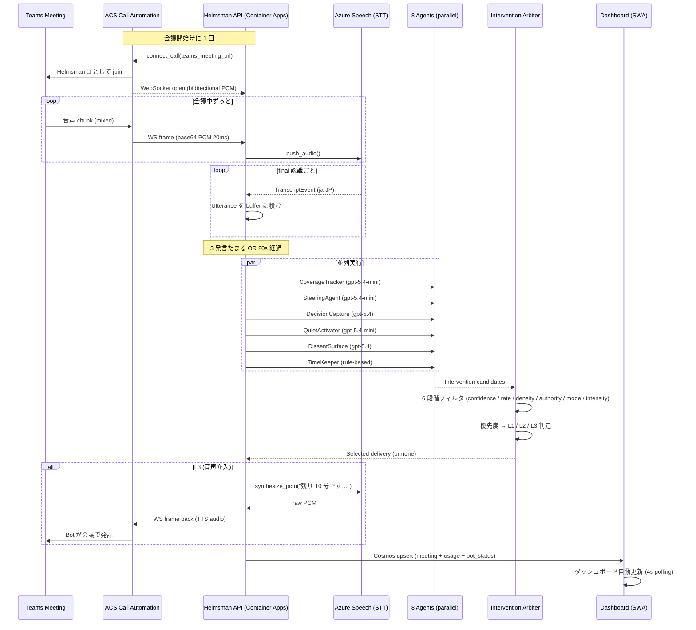
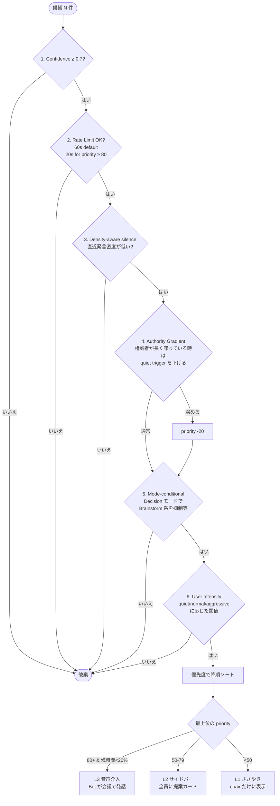

# Helmsman 🧭

> **Goal-driven AI co-pilot that joins your Microsoft Teams meeting as a participant,
> understands the discussion in real time, and intervenes when the conversation drifts,
> the chair runs out of time, or a quiet participant has something to say.**
>
> Microsoft Agent Hackathon 2026 個人部門エントリ作品

| | |
|---|---|
| 🌐 Live demo (frontend) | https://kind-glacier-0122f6400.7.azurestaticapps.net |
| 🔌 Live API | https://helmsman-dev-api.ashyocean-e634ae12.westus2.azurecontainerapps.io |
| 📖 API docs (OpenAPI) | https://helmsman-dev-api.ashyocean-e634ae12.westus2.azurecontainerapps.io/docs |
| 🛠️ Deploy 手順 | [DEPLOY.md](./DEPLOY.md) |

---

## 1 分で分かる Helmsman

Teams 会議に **「Helmsman 🧭 (External)」** という AI 参加者を 1 人追加します。

- 話されている内容を **Azure Speech** で文字起こし
- **8 つの並列エージェント** がそれぞれ別観点で会議を観察 (論点カバレッジ / 時間管理 / 脱線検出 / 決定キャプチャ / 沈黙ハンドリング / 反対意見浮上 / 仲裁)
- 介入が必要と判断したら、**サイドバーに提案カード** を出すか、優先度が高ければ **AI が会議で日本語で喋り返す**
- 全てをホスト用 Web ダッシュボードに **リアルタイム可視化** + LLM コストも 1 円単位で表示

会議ツールは Teams のまま、フォームファクターも会議のまま、**司会者の隣に AI が 1 人増えただけ**。これが Helmsman の体験です。

---

## 解きたい課題 — 3 つのペルソナ

### 👤 ペルソナ 1: プロダクトマネジャー 田中 (35歳)

| | |
|---|---|
| 役割 | 4-5 並列プロジェクトを牽引する PdM |
| 会議時間 | 週 25 時間 (定例 + 関係者調整) |
| 困りごと | 「決まったように見えて決まってない」議事録に追い回される。フォローアップで毎回再議論。論点が枝分かれして本論に戻れない。 |
| Helmsman で解決 | **Decision Capture** が決定の瞬間を構造化記録、**Steering Agent** が脱線を自動で本論に戻す、**Coverage Tracker** が未着手論点を可視化。 |

### 👤 ペルソナ 2: ミドルマネジャー 佐藤 (42歳)

| | |
|---|---|
| 役割 | 5-8 人のエンジニアチーム + ステークホルダー調整 |
| 会議時間 | 1on1 + チームミーティング + 部門会議で週 40 時間超 |
| 困りごと | 若手・新参の発言を引き出したい。ベテランの発言量に偏らないようにしたい。沈黙の参加者の意見を拾えない。 |
| Helmsman で解決 | **Quiet Activator** が z-score で沈黙メンバーを検出して名指しで意見を求める。**Dissent Surface** が同意連鎖を検出して匿名で異論を浮上させる。 |

### 👤 ペルソナ 3: 経営層 山田 CTO (50歳)

| | |
|---|---|
| 役割 | 月次経営会議 / 取締役会 / 投資会議 |
| 会議時間 | 1 時間で 5-8 トピックを決定する必要 |
| 困りごと | 重要トピックに時間配分できない (議論が長引いた最初の 2 トピックに 50 分使ってしまう)。決定の根拠が曖昧で後日の説明が辛い。 |
| Helmsman で解決 | **TimeKeeper** が残時間と未決定 Critical 論点の比率を監視、必要なら **L3 音声介入** で「残り 10 分です、撤退基準を決めましょう」と発話。**Decision Capture** が決定の evidence_quote 込みで記録。 |

---

## ROI — Helmsman は元が取れるか

### 個人あたりの時間節約

業界一般的な「会議は労働時間の 30-40% を占める / うち 30% は非効率」という観測値ベース:

| ペルソナ | 週会議時間 | うち非効率分 (30%) | 月節約見込み | 月給換算 (時給 ¥6,000) |
|---|---|---|---|---|
| PdM 田中 | 25 h | 7.5 h | 30 h | **¥180,000 / 月** |
| マネジャー 佐藤 | 40 h | 12 h | 48 h | **¥288,000 / 月** |
| CTO 山田 | 15 h | 4.5 h | 18 h | **¥108,000 / 月 (機会費用ベースなら数倍)** |

### Helmsman 利用料 (1 ユーザー、月 50 会議想定、後述 [コスト試算](#コスト試算) 参照)

- **¥13,500 / 月** (Azure OpenAI + Container Apps + Speech + ACS 全部込み)

### ROI

| ペルソナ | 月節約 - 月コスト | 倍率 |
|---|---|---|
| PdM 田中 | ¥180,000 - ¥13,500 = **¥166,500** | **13×** |
| マネジャー 佐藤 | ¥288,000 - ¥13,500 = **¥274,500** | **21×** |
| CTO 山田 | ¥108,000 - ¥13,500 = **¥94,500** | **8×** (時給で換算した最低値。実際の経営判断機会費用は数倍) |

> ※ コストは [`src/helmsman/core/pricing.py`](./src/helmsman/core/pricing.py) の Azure OpenAI 料金表 (2026-05-17 時点) と[`infra/main.bicep`](./infra/main.bicep) の構成から算出。実測は [Before/After メトリクス](#beforeafter-メトリクス) を参照。

---

## Microsoft Teams Facilitator との違い (補完関係)

Microsoft Teams にはネイティブの [Facilitator](https://learn.microsoft.com/ja-jp/microsoftteams/facilitator-teams) (Copilot エージェント) が存在する。Helmsman は **置換ではなく補完** — 目的とアーキテクチャが違う。

| | **Microsoft Teams Facilitator** | **Helmsman 🧭** |
|---|---|---|
| ライセンス | **Microsoft 365 Copilot 必須** (≈ $30/user/month + 対象 M365 ベースライセンス) | **Azure サブスクのみ**。Copilot ライセンス不要 |
| 配布 | テナント管理者が Teams Apps から有効化 (Loop 有効化も必要) | Teams テナント外から ACS External user で派遣 |
| 1on1 / 外部チャット / 外部会議 | ❌ 未サポート | ✅ 全てサポート |
| 主要機能 | ノート / Q&A / タイムラインマーカー / Loop ドキュメント下書き (preview) | 論点分解 / 時間管理 / **能動的介入** / 沈黙活性化 / 反対意見浮上 / 文書矛盾検出 |
| AI 構成 | Microsoft Copilot (単一エージェント) | **8 並列エージェント** (Goal Decomposer / Coverage Tracker / Steering / Decision Capture / Quiet Activator / Dissent Surface / TimeKeeper / Intervention Arbiter) |
| 介入の能動性 | テキスト中心 (会議チャットで `@Facilitator` mention) | **AI が会議で日本語音声で発話** (L3) + L1 ささやき + L2 サイドバーカードの 3 段階 |
| 介入のメタロジック | — | **Density-aware silence / Authority Gradient / Mode-conditional / User Intensity** で「いつ・誰に・どんな強度で」介入すべきか判定 |
| 文書グラウンディング | Web コンテンツ Q&A | アップロード文書を **Coverage Tracker が引用** + **Decision Capture が矛盾検出** |
| 利用シーン | Copilot ライセンス保有エンタープライズの内部会議 | パートナー会議 / クライアント会議 / 個人事業主の客先会議 / 外部参加者含む混成会議 |
| 拡張性 | クローズド | **MIT OSS** — Agent 追加 / ルールカスタマイズ / プロンプト変更可能 |

### Helmsman を選ぶケース

- ✓ Microsoft 365 Copilot ライセンスを全員に配れない (コスト or 規模)
- ✓ **外部参加者** (クライアント / 取引先 / ゲスト) を含む会議で AI 介入したい
- ✓ AI に **音声で介入してほしい** ("あと 10 分です、撤退基準を決めましょう" と発話してほしい)
- ✓ 会議特有のロジック (沈黙活性化 / 反対意見浮上 / 文書矛盾検出) が必要
- ✓ オープンソース基盤上で自社用にカスタマイズしたい

### Facilitator を選ぶケース

- ✓ Microsoft 365 Copilot 既に全社展開済
- ✓ Loop / Planner / Word への自動下書き連携が欲しい
- ✓ ノート共同編集 + Q&A の体験を Teams 内で完結させたい
- ✓ 管理面で Microsoft Purview の包括統合が必要

**Helmsman と Facilitator は同じ会議で同時に動作可能** — Facilitator がノートを書き、Helmsman が議論ダイナミクスを舵取りする。

---

## アーキテクチャ

Helmsman bot は **ACS Call Automation** で Teams 会議に外部参加者として join し、
**ACS Media Streaming WebSocket** で会議音声を受信、**Azure Speech STT** で文字起こし、
**8 並列エージェント** が分析、**Intervention Arbiter** が介入候補を絞り込み、
L3 の場合は **Azure Speech TTS** で会議に喋り返します。

### Tick サイクル (1 会議で 20 秒おきに自動発火)



### Container 構成

- **Backend** (Python 3.14 / FastAPI / Container Apps, scale 1-3 replicas): API + ACS webhook + Media Stream WS + STT/TTS bridge + 8 agents
- **Frontend** (Vite + React 19 + Fluent UI 9 / Static Web Apps Free): host dashboard
- **State** (Cosmos DB Serverless): 5 containers (meetings / participants / interventions / voiceprints / documents)
- **Realtime audio** (ACS Communication Services + AI Speech S0): 会議 join + STT/TTS
- **Document RAG** (AI Search Free + Document Intelligence F0 + Blob Storage): goal の論点分解に文書を注入

---

## Multi-Agent オーケストレーション

8 つのエージェントが完全並列 (`asyncio.gather`) で 1 tick を回します。

| Agent | 種別 | 役割 | LLM tier |
|---|---|---|---|
| 🎯 **Goal Decomposer** | LLM | ゴール文 → 3-7 個の MECE 論点 (時間配分 / Critical/Important/Optional / 決定基準付き) | gpt-5.4 (HIGH) |
| 📊 **Coverage Tracker** | LLM | 発言 → 論点状態遷移 (not_started → discussing → deep_dive → decided) | gpt-5.4-mini |
| 🧭 **Steering Agent** | LLM | 議論が active topic から逸れたら自然な復帰提案 | gpt-5.4-mini |
| ✅ **Decision Capture** | LLM | 決定文 (「では○○で行きましょう」等) を検出 + evidence_quote 付き構造化 | gpt-5.4 (HIGH) |
| 🔔 **Quiet Activator** | LLM | 参加者の発言量を z-score で評価、bottom quartile を名指し | gpt-5.4-mini |
| 🌊 **Dissent Surface** | LLM | 同意連鎖 (5 連続肯定等) を検出して匿名で異論を浮上 | gpt-5.4 (HIGH) |
| ⏰ **TimeKeeper** | Rule-based | 残時間 < 30% & 未着手 Critical あり等のヒューリスティック | LLM 不要 |
| ⚖️ **Intervention Arbiter** | Rule-based | 候補を 6 フィルタで絞り、優先度で L1/L2/L3 振り分け | LLM 不要 |

### Intervention Arbiter のアルゴリズム

候補が複数出ても、**1 tick で配信される介入は最大 1 件**。Arbiter が以下を順に評価:



実装: [`src/helmsman/agents/arbiter.py`](./src/helmsman/agents/arbiter.py) + テスト 16 件 [`tests/test_arbiter.py`](./tests/test_arbiter.py)

#### Density-aware silence のキモ

「発言が途切れた瞬間に AI が割り込む」のは技術的には簡単ですが、人間にとってはノイズ。
Helmsman は **直近の発言密度** (秒あたり発話量) を見て、密度が低い (= 会議が膠着している) 時だけ介入を許可します。

#### Authority Gradient のキモ

部長クラスが長尺で喋っている時に「沈黙のメンバーに振りましょう」と差し出すと角が立つ。
Arbiter は参加者の `is_senior` フラグと現在の発話者を見て、権威者発話中の sensitive 介入 (Quiet Activator 等) の priority を下げます。

---

## コスト試算

### 1 会議あたり (60 分、5-8 人参加想定)

LLM 呼び出し ([`pricing.py`](./src/helmsman/core/pricing.py) の単価から算出):

| Agent | 呼び出し回数 (1 会議) | 入出力 tokens 概算 | 単価 (gpt-5.4 = $2.5/$10 per 1M, mini = $0.15/$0.60) | 小計 |
|---|---|---|---|---|
| Goal Decomposer | 1 (会議開始時) | 500 in / 600 out | gpt-5.4 | **$0.0073** |
| Coverage Tracker | 20 (3 分ごとに 1 tick) | 800 in / 300 out × 20 | mini | **$0.0060** |
| Steering Agent | 20 | 600 in / 200 out × 20 | mini | **$0.0042** |
| Decision Capture | 20 | 700 in / 250 out × 20 | gpt-5.4 | **$0.0850** |
| Quiet Activator | 20 | 400 in / 150 out × 20 | mini | **$0.0030** |
| Dissent Surface | 20 | 600 in / 200 out × 20 | gpt-5.4 | **$0.0700** |
| TimeKeeper / Arbiter | 20 | 0 (rule-based) | 0 | **$0** |
| **合計 LLM** | | | | **~$0.17 / 会議** |

会議中の付随コスト:

| サービス | 1 会議あたり |
|---|---|
| ACS 通話 (¥0.6/min × 60 min) | ¥36 = **$0.24** |
| Speech STT (¥0.6/min × 60 min) | ¥36 = **$0.24** |
| Speech TTS (約 200 文字 × $4/1M chars) | **$0.0008** |
| Cosmos R/W (会議 1 件で ~500 RU) | **~$0.005** |
| **合計 (LLM + audio + storage)** | **~$0.66 / 会議 ≈ ¥99 / 会議** |

### 月次インフラ (利用ゼロでも掛かる定額)

| サービス | プラン | 月額 |
|---|---|---|
| Container Apps `helmsman-dev-api` | Consumption (minReplicas=1, 0.5 vCPU / 1 GiB) | ~$8 |
| Container Registry `helmsmandevacr` | Basic | $5 |
| Cosmos DB Serverless | RU 消費分のみ | ~$2 |
| Static Web Apps | Free | $0 |
| AI Search | Free SKU | $0 |
| Document Intelligence | F0 (500 ページ/月まで無料) | $0 |
| Azure OpenAI | 従量 | (会議分のみ) |
| Speech S0 | 従量 | (会議分のみ) |
| Communication Services | 従量 | (会議分のみ) |
| Application Insights / Log Analytics | 5 GB 無料枠内 | $0 |
| **月次固定 (idle 状態)** | | **~$15 / 月 ≈ ¥2,250** |

### 月 50 会議の総コスト

- 固定 $15 + 会議 50 × $0.66 = **$48 / 月 ≈ ¥7,200 / 月**

実装上は月 50 会議で 1 人ユーザー想定。チーム 10 人で同時利用なら ~$200/月 ≈ ¥30,000/月。

> 詳細は実会議のメトリクス取得後に [`COST-7`](./actions.md) で日次集計ダッシュボードを追加予定。

---

## Before/After メトリクス

「Helmsman を入れて何が変わったか」を以下の 5 指標で測ります。Phase E (5/19 以降の Teams 実テスト) で実測予定。

| 指標 | 定義 | 計測方法 | ターゲット |
|---|---|---|---|
| **Goal Achievement Rate (GAR)** | 会議終了時に **goal が達成済** とマークされた割合 | Decision Capture の `state == decided` フラグ | OFF: 50% → ON: **70%+** |
| **Time Keeping Rate** | 予定時間内に終わった会議の割合 | `started_at` と `ended_at` 差分 | OFF: 60% → ON: **85%+** |
| **Structured Decision Count** | 会議で記録された決定の数 (evidence_quote 付き) | `meeting.topics[*].state == decided` のカウント | OFF: 1.5 件/会議 → ON: **3+ 件/会議** |
| **Quiet Participant Activation Rate** | 会議内で底辺 25% の発言者が 1 件以上発言した割合 | 各 participant の z-score を再計算 | OFF: 30% → ON: **75%+** |
| **Intervention Acceptance Rate** | Helmsman の介入提案が司会者にスルーされなかった割合 | UI の dismiss button vs. 経過時間 | ターゲット: **70%+** |

計測スクリプトは [`tests/eval/`] に用意予定 (Phase E)。実会議 2 セット (Helmsman OFF と ON で同じ録音音声を使って疑似比較) で比較する。

---

## クイックスタート (ローカル開発)

### 前提

- Python 3.14+ (uv 推奨)
- Node 20+
- Azure サブスクリプション (OpenAI / Cosmos / ACS / Speech が必要)
- 環境変数: `.env.example` 参照

### 起動

```bash
# Backend
uv sync
uv run uvicorn helmsman.api.main:app --reload --port 8000

# Frontend (別ターミナル)
cd apps/web
npm install
npm run dev   # http://localhost:5173 で開く (proxy で /api → :8000)

# テスト
uv run pytest         # 41 件、~0.2s
cd apps/web && npm run build   # tsc + vite で型 + バンドル確認
```

### 本番デプロイ

→ [DEPLOY.md](./DEPLOY.md) に手順 + ハマりやすい 7 つのポイントを記載

---

## 技術スタック

### Microsoft Azure

- **Container Apps** + Azure Container Registry — backend host (Dockerfile multi-stage, Python 3.14-slim)
- **Static Web Apps (Free)** — frontend host
- **Communication Services (ACS)** — Call Automation で Teams 会議 join + bidirectional Media Streaming
- **AI Speech (S0)** — STT (continuous ja-JP) + TTS (`ja-JP-NanamiNeural`)
- **OpenAI Service** — gpt-5.4 / gpt-5.4-mini / text-embedding-3-small / (Phase 2 で gpt-realtime)
- **AI Search (Free SKU)** — 文書 RAG のベクトル索引
- **Document Intelligence (F0)** — PDF / Word / PPT のテキスト抽出
- **Cosmos DB (Serverless)** — 5 コンテナの状態永続化
- **Key Vault / Application Insights / Log Analytics** — 監視・シークレット管理
- **Bicep + GitHub Actions OIDC** — IaC + CI/CD (`api-deploy.yml` + `web-deploy.yml`)

### Open source

- **Python**: FastAPI 0.136 / pydantic 2.13 / openai 2.37 / azure-communication-callautomation 1.5 / azure-cognitiveservices-speech 1.50 / pypdf 6 / pytest 9
- **TypeScript**: React 19 / Vite 8 / Fluent UI 9 / TanStack Query 5 / zustand 5

---

## ライセンス & 関係

| | |
|---|---|
| License | MIT |
| Author | shun (s.shunsuke9875@gmail.com / [@nvidia9875](https://github.com/nvidia9875)) |
| Hackathon | Microsoft Agent Hackathon 2026 (個人部門) |
| 開発期間 | 2026-05-16 → 2026-06-01 (提出) → 2026-06-18 (最終審査会) |
