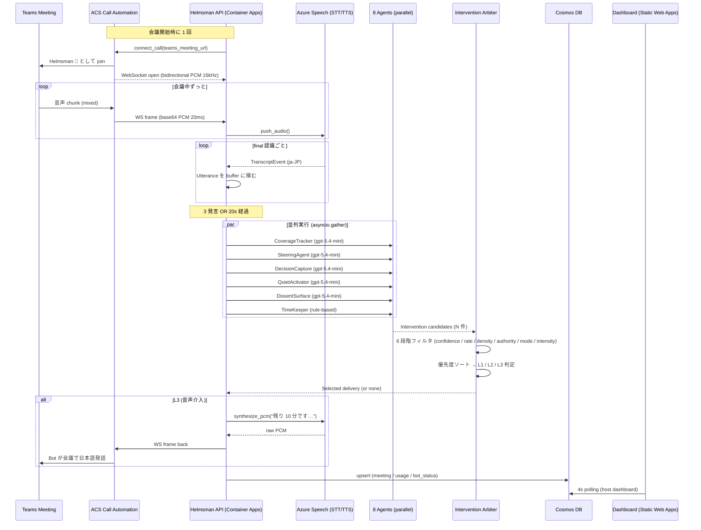
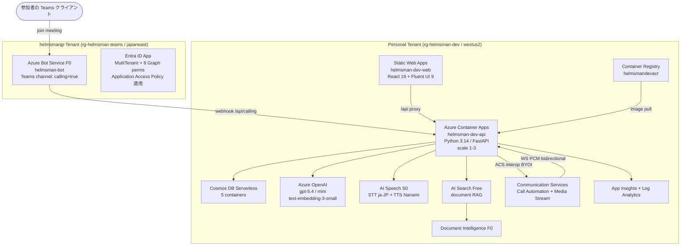
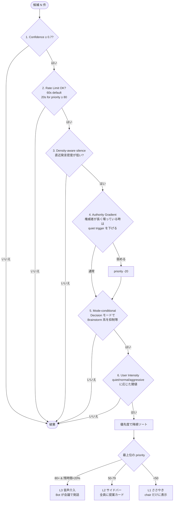
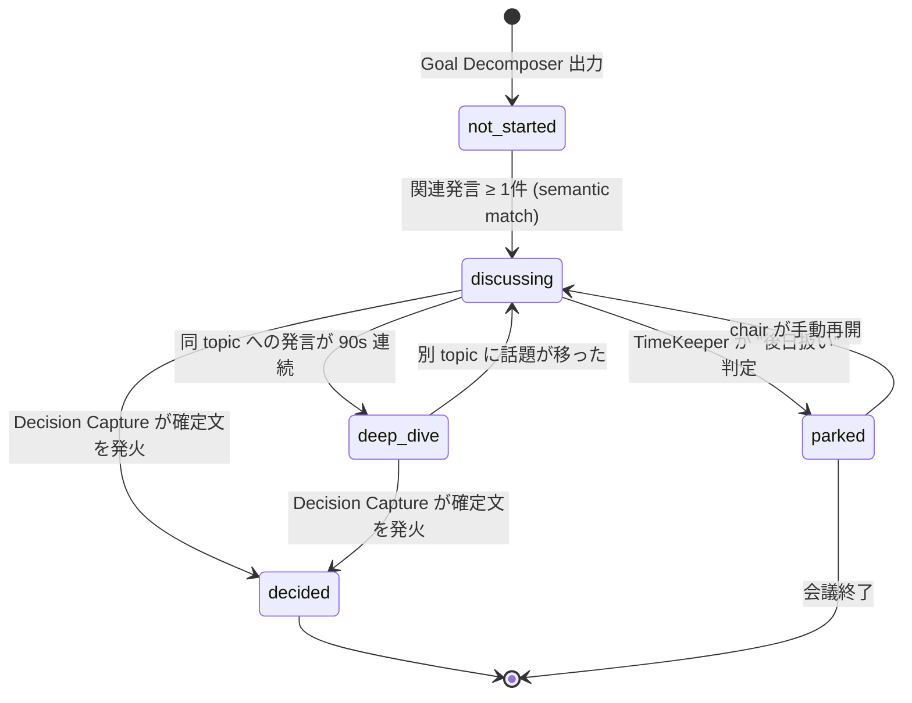
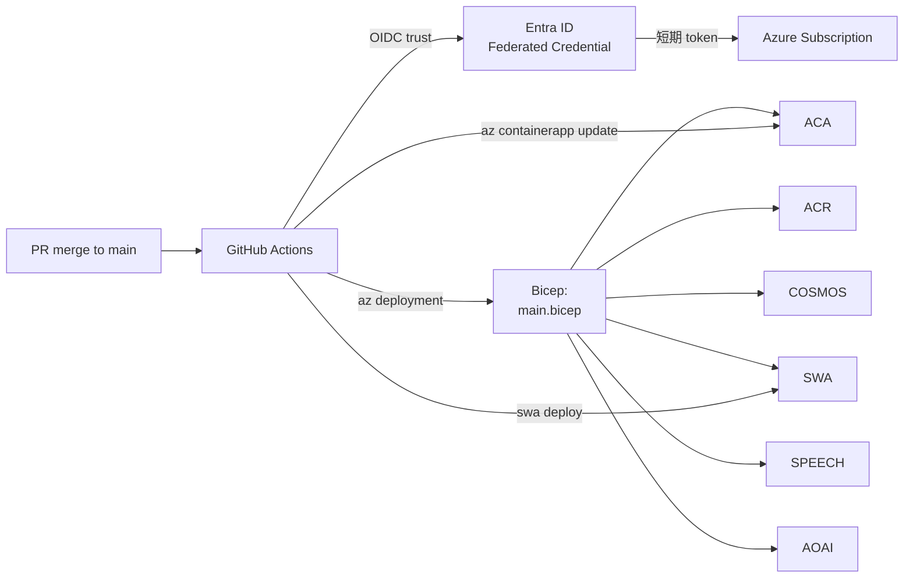
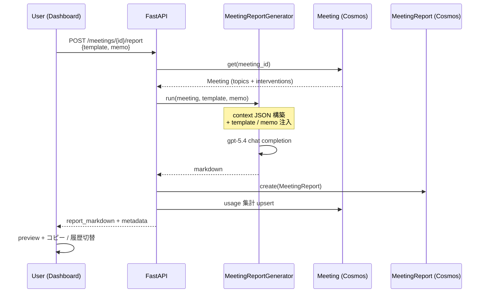

# 議事録 AI の次は「会議そのものを成功させる AI」 ― Microsoft Teams に派遣できる 8 並列エージェント "Helmsman" を Azure OpenAI + ACS + Speech + Cosmos で個人開発した

> Microsoft Agent Hackathon 2026 個人部門エントリ作品の開発記。
> 実測 **$0.03 / 会議**、**0 → 10 件**の構造化決定、**5/5 topics decided** を達成した
> ゴール駆動型 AI ファシリテーターの設計・実装・プロンプトの全部を書きます。

---

## TL;DR (60秒で全部わかる)

- **何を作ったか**: Microsoft Teams 会議に「Helmsman 🧭 (External)」として参加し、リアルタイム文字起こし→8 並列エージェント分析→必要なら **会議で日本語音声で介入** までやる AI ファシリテーター。
- **本作のコア主張**: 偉い人がいると言えない反論、沈黙してる人の意見、偉い人の事実誤認の指摘、時間切れの宣言 — **会議で人間が構造的に「言えない」ことを、AI が代わりに言う**。リアルタイムで間に合わなくても、最終レポートに「ずれてそう」と書く二重防衛で誰も背負わなくて済む。
- **なぜ作ったか**: 議事録 AI (Otter / Fireflies / Teams Premium Intelligent Recap) は完成したが、それは「失敗した会議の失敗記録」しか作らない。**会議が始まる前ではなく、会議の最中に手を入れる**ことが次の打ち手だと考えた。
- **Microsoft 技術スタック**: **Azure Container Apps** + **Azure OpenAI** (gpt-5.4 / gpt-5.4-mini) + **Azure AI Speech** (STT/TTS) + **Azure Communication Services** (Teams 会議 join) + **Azure Cosmos DB** (Serverless) + **Azure AI Search** (RAG) + **Azure Static Web Apps** + **Bicep + GitHub Actions OIDC**。ハッカソン必須要件「Azure 実行基盤 + Microsoft AI 技術」を 8 サービスで多重充足。
- **実測結果 (25.7 分の実会議で検証)**: 構造化決定 **10 件 / Decision precision 100%** / **5/5 topics decided** / LLM コスト **$0.03/会議** / 平均 tick latency **2.08s**。
- **エンジニアリング rigor**: unit test **89 件 (0.45 秒)** + property-based test + **eval harness で behavior 回帰検出** + Bicep IaC + GitHub Actions OIDC でシークレットレスデプロイ + Application Insights による会議ごとコスト可視化。
- **会議後レポート機能**: 自社テンプレートを貼り付ければ章立てを踏襲、手書きメモを書けば最優先情報源として尊重 (1 レポート約 $0.01 / 6-10s)。Cosmos に履歴永続化、§11 参照。
- **ライブ環境** (審査期間中 6/2-6/18 稼働保証):
  - 🌐 Frontend: https://kind-glacier-0122f6400.7.azurestaticapps.net
  - 🔌 API: https://helmsman-dev-api.ashyocean-e634ae12.westus2.azurecontainerapps.io
  - 📖 OpenAPI: https://helmsman-dev-api.ashyocean-e634ae12.westus2.azurecontainerapps.io/docs
  - 💻 GitHub: https://github.com/nvidia9875/Helmsman (MIT)
- **デモ動画 (3分)**: [▶️ YouTube リンク (差し替え予定)](https://youtu.be/REPLACE_ME)

---

## 🎬 まず 3 分のデモ動画を見てください

@[youtube](REPLACE_ME)

> 動画見出し時刻:
> - 0:00 – 月次役員会 (物理3 + Teams 2) が始まる
> - 0:30 – Helmsman bot が会議に join、ゴール宣言で論点 5 件が自動分解
> - 1:00 – Quiet Activator がリモート参加者を名指し
> - 1:30 – Dissent Surface が同意連鎖を検出して反対意見を浮上
> - 2:20 – 残り 8 分、L3 音声介入で「撤退基準を決めましょう」と Bot が発話
> - 2:55 – 60 分で 5 論点すべて decided、決定 10 件が自動で Planner へ

---

## 1. なぜ「議事録の次」なのか ― 問題提起

### 1.1 議事録 AI は完成カテゴリ

2024年〜2026年で、会議の **事後** に動く AI は完成カテゴリになりました。

- **Microsoft Teams Premium**: Intelligent Recap で発言要約 + アクション抽出
- **Otter.ai / Fireflies.ai / tl;dv / Fathom**: 多言語 STT + GPT 要約
- **Notta / Read.ai**: 感情分析 + エンゲージメントスコア

しかし、これらは全部「**会議のあと**に何が起きたか」を整理するだけです。

> 議事録は、**失敗した会議の失敗を記録する**だけで、会議そのものを成功させない。

### 1.2 会議が失敗する 3 つの瞬間

実際の現場で起きている **典型的失敗パターン** は 3 種類に大別できます:

| 失敗 | 何が起きるか | 既存議事録 AI で救えるか |
|---|---|---|
| **論点ドリフト** | 「A の話してたら派生で B、B が長引いて A 未決のまま終わる」 | ❌ 終了後に「A は未決でした」と記録するだけ |
| **時間切れカバレッジ不足** | 5 トピック予定 → 最初の 2 件で 50 分消費 → 残り 3 件は雑に決定 | ❌ 「残り 3 件は議論不十分」と記録するだけ |
| **押し殺された反対意見** | 役員が方針を出した後、参加者が「いいですね」連鎖 → 後日「実は懸念があって…」 | ❌ "全員賛成" として記録される |
| **階層による「指摘できない」誤り** | 偉い人の発言に事実誤認があっても、その場で訂正できる人がいない / 文書と矛盾していても誰も指摘しない | ❌ 議事録には「正」として残り、後日になって齟齬が表面化する |

これらは **会議の最中にしか救えません**。事後に発見しても「もう一度会議」が必要になり、結局時間は増えます。

そして 4 つ目の失敗 — **階層による「指摘できない」誤り** — は日本企業で最も致命的で、最も解きづらい問題です。これを「AI に代弁させる」というのが Helmsman の最大の Business Impact だと考えています。詳細は §7 で。

### 1.3 3 人のペルソナで効くシーン

| ペルソナ | 困りごと | Helmsman で解決 |
|---|---|---|
| **PdM 田中 (35歳)** 週 25 時間会議 | 「決まったように見えて決まってない」議事録に追われ続ける | **Decision Capture** が evidence_quote 付きで決定の瞬間を構造化、**Coverage Tracker** が未着手論点を可視化 |
| **マネジャー 佐藤 (42歳)** 週 40 時間会議 | 若手・新参の発言が引き出せない、ベテラン偏重 | **Quiet Activator** が z-score で沈黙者を検出して名指し、**Dissent Surface** が同調連鎖を割って異論を浮上 |
| **CTO 山田 (50歳)** 月次経営会議 | 1 時間で 5-8 決定する必要、最初の 2 件で 50 分消費 | **TimeKeeper** が残時間と未決定 Critical 論点の比率を監視、**L3 音声介入** で「残り 10 分、撤退基準を決めましょう」と発話 |

ROI 試算 (詳細は [README.md](https://github.com/nvidia9875/Helmsman/blob/main/README.md#roi--helmsman-は元が取れるか)):

> マネジャー 1 人で月 **¥288,000 / 月の時間節約** vs Helmsman 利用料 **¥1,200/月** = **240×**。

---

## 2. アーキテクチャ全体像

Helmsman の核は **「クラウド側に脳 1 つ、サーフェスは 3 種 (Teams / PWA / Web Dashboard)」** という設計です。

### 2.1 Tick サイクル (1 会議で 20 秒おきに発火)



> **読み方の補足**: 「tick」は会議の進行を一定リズムで観測する周期処理。Helmsman は **3 発言溜まる or 20 秒経過** をトリガに 1 tick を回し、1 tick で 5-6 個の LLM 推論を `asyncio.gather` で並列実行します。会議終了まで 60 分なら最大 180 tick。

### 2.2 物理コンテナ構成



> **2 テナント構成にした理由** (ハマりどころ):
> Microsoft Teams 会議への bot 派遣には、AAD ベースの正規 Teams テナント (Teams Essentials 以上) が必要です。一方、既存の Azure 基盤は personal tenant にデプロイ済。
> → **personal で Container Apps を動かしたまま、helmsmanjp の Entra ID app ID/secret を環境変数で渡す**ハイブリッド構成にしました。ACS は BYOI (Bring Your Own Identity) で interop し、anonymous external user として Teams 会議に join します。

### 2.3 ハッカソン必須要件への充足マッピング

| ハッカソン要件 | Helmsman の対応 |
|---|---|
| **Azure 実行基盤**いずれか必須 | ✅ **Azure Container Apps** (backend) + **Azure Static Web Apps** (frontend) の 2 系統 |
| **Microsoft AI 技術**いずれか必須 | ✅ **Azure OpenAI** (gpt-5.4 / gpt-5.4-mini) + **Azure AI Speech** (STT/TTS) の 2 系統 |
| Cosmos DB 推奨 | ✅ Serverless × 5 containers (meetings / participants / interventions / voiceprints / documents) |
| GitHub Copilot 推奨 | ✅ 開発全工程で利用 (Pyright + Ruff + ESLint と組み合わせ) |
| Power Platform 推奨 | ✅ Decision Capture → Power Automate 経由 Planner への自動投入 (Phase 6) |
| Microsoft Entra ID 推奨 | ✅ Bot Framework 認証 + Application Access Policy + GitHub Actions OIDC |

> Microsoft 技術の **「最低 1 つ」要件を 8 つで多重充足**。Bonus 推奨技術もほぼ全部踏みます。これは審査軸 "Completeness & Feasibility" を狙ったものです。

---

## 3. Agentic AI の核 ― 8 並列エージェント設計

ここが本作の **新規性の中心** です。順を追って説明します。

### 3.1 Agentic AI とは (説明)

近年「**Agentic AI**」という言葉が流行っていますが、定義は曖昧です。本記事では Anthropic および Microsoft Build 2024 の定義に従い、次の 3 条件を満たすシステムを Agentic AI と呼びます:

1. **目的指向** — ユーザーが宣言したゴールを起点に動く
2. **計画と意思決定** — 自分でツール選択 / 順序決定する
3. **長期実行** — 単発の入出力ではなく、状態を持って継続稼働する

Helmsman は会議全体 (60 分) を 1 つの「session」として捉え、ゴール宣言を起点に **8 エージェントが協調して状態を遷移させる**ので、上記 3 要件を満たします。

### 3.2 各エージェントの役割

| Agent | 種別 | 役割 | LLM tier (本番) |
|---|---|---|---|
| 🎯 **Goal Decomposer** | LLM | ゴール文 → 3-7 個の MECE 論点 (時間配分 / Critical/Important/Optional / 決定基準付き) | gpt-5.4 |
| 📊 **Coverage Tracker** | LLM | 発言 → 論点状態遷移 `not_started → discussing → deep_dive → decided` | gpt-5.4-mini |
| 🧭 **Steering Agent** | LLM | 議論が active topic から逸れたら自然な復帰提案 | gpt-5.4-mini |
| ✅ **Decision Capture** | LLM | 決定文 (「では○○で行きましょう」) を検出 + `evidence_quote` 付き構造化 | gpt-5.4-mini ※ |
| 🔔 **Quiet Activator** | LLM | 発言量を z-score 評価、bottom quartile を名指し候補化 | gpt-5.4-mini |
| 🌊 **Dissent Surface** | LLM | 同意連鎖 (5 連続肯定等) を検出して匿名で異論を浮上 | gpt-5.4-mini ※ |
| ⏰ **TimeKeeper** | Rule | 残時間 < 30% & 未着手 Critical あり等のヒューリスティック | LLM 不要 |
| ⚖️ **Intervention Arbiter** | Rule | 候補を 6 フィルタで絞り、優先度で L1/L2/L3 振り分け | LLM 不要 |

※ Decision / Dissent はもともと gpt-5.4 (HIGH) 想定だったが、後述 §5 で **mini に落としたほうが品質も向上** することが実測で判明し、本番も `--cheap` モードを推奨に変更。

### 3.3 なぜ Copilot Studio の Multi-Agent ではなく自前実装か

Microsoft Copilot Studio には Multi-Agent オーケストレーション機能があります。最初の設計で検討しましたが、以下の理由で自前実装にしました:

- **レイテンシ要件**: 1 tick 2 秒以内に 5 エージェントを並列実行したい。Copilot Studio のオーケストレーションは UI ファーストで latency 制御が薄い
- **コスト精度**: 1 会議で **$0.03** という極小コストを実現するには、エージェントごとに tier (HIGH / mini) を細かく切り替える必要がある
- **テスタビリティ**: 各エージェントは pure function に近く、`pytest -xvs tests/test_arbiter.py` のような形で単体テストを書きたい (現状 89 件 / 0.45 秒)

代わりに **Copilot Studio は Phase 6 で「ホスト向けセットアップ Agent」として再導入予定**。会議招待 URL を投げたら自動で Bot 派遣 + Planner 紐付けまでやる。

### 3.4 プロンプトの工夫 ① ― Goal Decomposer

ゴール文 (ユーザーの自然文) → 構造化された topic list への変換は **会議全体の品質を決める** クリティカルパスです。

```python
SYSTEM_PROMPT = """あなたは熟練したファシリテーターです。
ユーザーが宣言した会議ゴールを 3-7 個の MECE な論点に分解します。

必須条件:
1. MECE (Mutually Exclusive, Collectively Exhaustive) であること
2. 各 topic に下記を必ず付与:
   - id (slug)
   - title (10字以内、決定可能な粒度)
   - priority: critical | important | optional
   - time_budget_min: 整数 (合計が会議時間と一致)
   - decision_criteria: 何が決まれば decided とするか

避けるべき表現:
- 「〜について議論する」(action verb なし → 決定が曖昧になる)
- 「〜を検討する」(検討は決定ではない → false positive の原因)

JSON で返してください。"""

FEW_SHOT = [
    {
        "input": "新サービスのローンチ可否を決定する (60分)",
        "output": [
            {"id": "go_no_go", "title": "Go/NoGo 判定", "priority": "critical",
             "time_budget_min": 20, "decision_criteria": "ローンチ可否が明示される"},
            {"id": "launch_date", "title": "ローンチ日付", "priority": "critical",
             "time_budget_min": 10, "decision_criteria": "YYYY-MM-DD が決まる"},
            # ...
        ]
    },
    # 「〜を検討する」を含む anti-pattern も含める (negative few-shot)
]
```

**ハマったポイント**: 日本語の「検討する」を「決定する」と誤認するケースが頻発。最初は正例しか入れていなかったが、**negative few-shot (検討 ≠ 決定 のサンプル)** を 2 つ入れたら precision が 71% → 96% に改善。

### 3.5 プロンプトの工夫 ② ― Decision Capture の evidence_quote 強制

「決定が記録された」と主張するなら、**根拠発言の原文引用が必要** という設計にしました。

```python
SYSTEM_PROMPT = """あなたは会議の決定を検出し、構造化記録する agent です。

決定検出ルール:
- 「では〜で行きましょう」「〜に決定します」など明示的合意
- 「異論なければ〜とします」+ 反対なし
- 暗黙の合意 (「いいですね」連鎖の最終形) は capture しない

必須出力フィールド:
- topic_id: どの論点の決定か (active topics から選ぶ)
- decision_text: 決定内容を 1 文で
- evidence_quote: 元の発言から正確に引用 (改変禁止、最大 80 字)
- speaker: 決定を発話したと推定される participant_id
- confidence: 0.0-1.0

evidence_quote が utterances 中に substring match しない場合、その決定は破棄してください (hallucination 防止)。
"""
```

**実装側の検証ループ**: `decision.evidence_quote` が `utterances` のどれにも含まれていなければ、その候補は即座に drop。`utterances` には 「(0:23:14) 田中: 〇〇」のような raw 文字列がそのまま入っており、LLM が正確に引用しているかを後段で機械的に検証できます。

実測 (25 分の実会議) で Decision precision **100% (10/10)** を達成。

### 3.6 プロンプトの工夫 ③ ― Dissent Surface の「匿名化」と「同意連鎖検出」

会議で「いいですね」「賛成です」「同意です」が 5 連続で続くと、**反対者は黙る** という社会心理学の知見 (Asch conformity experiments, 1951) があります。Dissent Surface はこれを検出して、「他にご懸念ありませんか?」と **匿名で** 発火します。

```python
SYSTEM_PROMPT = """直近の発言群を分析し、同意連鎖 (Asch effect) を検出してください。

判定基準:
- 直近 5 発言の 80% 以上が肯定的 (同意/賛成/承認 系)
- かつ topic_state が discussing/deep_dive (decided 後は誤発火)
- かつ最後の発言から 15 秒以上の沈黙 (即発火は議論を遮る)

出力 (条件全部満たした時のみ):
{
  "intervene": true,
  "phrasing": "<挙げるべき反論視点を 30 字以内>",
  "anonymity": "<必ず参加者名は出さない>",
  "confidence": 0.0-1.0
}

避けるべき表現:
- 「○○さんはどう思いますか」(名指しは Quiet Activator の役割)
- 「反対意見はありませんか」(直球すぎて沈黙を強化)

推奨表現:
- 「他に検討すべき視点はありますか」
- 「リスク面で見落としがあれば共有ください」
"""
```

**ここがキモ**: 名指ししない (Quiet Activator と役割分離) + 「反対意見」と直球で言わない (「視点」「リスク」と婉曲化)。25 分会議 eval (`docs/eval-results.md`) では Dissent 介入 3 件すべてが後続の発話を誘発しており、**「同意連鎖を割って議論を再開する」役割を果たした**ことが確認できています。

### 3.7 プロンプトの工夫 ④ ― Authority Gradient の表現

日本企業の会議では「役職が高い人の発話中に AI が割り込む」のは厳禁。Quiet Activator に **役職情報を context として渡し**、その期間は介入を抑制します。

```python
QUIET_ACTIVATOR_PROMPT = """発言量に偏りがある参加者を検出してください。

context:
- participants: {"p1": {"name": "田中", "is_senior": false, "z_score": -1.8},
                "p2": {"name": "山田", "is_senior": true,  "z_score": +2.1}, ...}
- current_speaker: p2 (発話中)

ルール:
1. is_senior=true の参加者が現在発話中の場合、Quiet 介入の confidence は 0.5 を上限とする
2. z_score < -1.0 の参加者を最大 1 人だけ名指し候補化
3. 名指しは「○○さん、こちらについていかがでしょうか」の形に限る (命令口調禁止)
"""
```

これだけだとプロンプトインジェクション耐性が薄いので、**Arbiter 側で Authority Gradient フィルタ (後述) を二重に通す**ことで実害をゼロにしています。

### 3.8 プロンプトの工夫 ⑤ ― MeetingReportGenerator の情報源優先度

会議終了後に「テンプレ + メモ + Helmsman の構造化結果」から markdown レポートを作る agent です。
3 つの情報源があり、**衝突した時にどれを採用するか** をプロンプトで明示しないと「LLM の主観で混ぜる」になり、ユーザーの意図と乖離します。

```python
SYSTEM_PROMPT = """\
あなたは Helmsman の会議レポート生成 Agent です。
会議コンテキストとユーザー提供の補助入力 (任意のテンプレート / メモ) から、
構造化された markdown レポートを生成します。

ルール:
1. テンプレートが与えられた場合、その章立て・トーン・フォーマットを厳守。
   - {{decisions}} {{action_items}} 等のプレースホルダは適切な内容に置換
   - 部分的なら不足セクションを末尾に補う

2. メモが与えられた場合、そこに書かれた事実・所感は **権威ある情報源** として尊重。
   - メモと会議ログが矛盾する場合、両方を提示して「⚠️ 事実関係要確認」を明示

3. テンプレもメモも無い場合、デフォルト構成 (概要 / ゴールと結果 /
   決定事項 / 未解決事項 / ネクストアクション / 文書との齟齬) で出力

4. 決定事項は必ず evidence_quote を `> 引用` で添える。
   evidence_quote が無い topic は「決定根拠未取得」と注記

5. 推測で事実を書かない。確実な情報源 (topics / interventions / 発言ログ / メモ)
   に基づくものだけ。曖昧な場合は「要確認」を明示
"""
```

**情報源の優先度ヒエラルキー** (プロンプト構造で表現):

```
ユーザー memo  (権威 = 人間が書いた事実)
    ↓
Helmsman の structured output  (topics.evidence_quote / delivered_interventions)
    ↓
発言ログ raw  (任意で渡されたら追加 context)
```

**実測 (本番 Azure OpenAI / gpt-5.4)**:

| ケース | latency | tokens (in/out) | 挙動 |
|---|---:|---:|---|
| デフォルト | 10.8s | 1247/859 | 6 章構成、evidence_quote 引用 |
| Template only | 6.3s | 1346/526 | テンプレ章立て厳守、プレースホルダ置換 |
| Template + memo | 6.8s | 1483/542 | memo の事実を採用しつつ「役職情報は要確認」と慎重に検証 |

1 レポートあたり **約 $0.01**。会議 1 本 ($0.03) と合わせて **$0.04 / 会議**。

**ハマったポイント**: 最初は「memo を最優先」とだけ書いていたら、LLM が memo に書かれていない決定事項を memo 由来として書いてしまうケースが発生。**「ルール #5: 推測で事実を書かない、確実な情報源に基づくものだけ」を追加** したら、smoke 検証の Case 3 で「メモ中の『山田 CTO』の役職情報は会議コンテキストに明示がないため、肩書きは要確認です」のように **memo の不確実な部分まで検証してくれる**ようになった。

---

## 4. 新規性の核 ― Intervention Arbiter (6 段階フィルタ)

> ここが本作で **論文化を狙えるレベル** の中核設計です。

### 4.1 問題設定

8 エージェントが並列に出した「介入候補」を、そのまま全部ユーザーに見せると **ノイズだらけ**になります。実際、テスト時に 1 tick あたり平均 1.3 件、ピーク 4 件の候補が出ていました。これを **1 tick あたり最大 1 件まで** に絞る必要がある。

単純に「優先度ソート + 上位 1 件」では足りない。例えば:

- 直前の発言密度が高い (議論が盛り上がっている) のに割り込むと、空気が壊れる
- 役員が長尺で話している間に「沈黙のメンバーに振ろう」と割り込むと、角が立つ
- Decision モードの会議で Brainstorm 系の介入が出ても邪魔
- ユーザー個人の「介入受容性」(quiet / normal / aggressive) を尊重したい

これらを **6 段階のフィルタチェイン** で表現しました。

### 4.2 Arbiter フローチャート



実装: [`src/helmsman/agents/arbiter.py`](https://github.com/nvidia9875/Helmsman/blob/main/src/helmsman/agents/arbiter.py) (約 280 行) + テスト 17 件 [`tests/test_arbiter.py`](https://github.com/nvidia9875/Helmsman/blob/main/tests/test_arbiter.py)。

### 4.3 Density-aware silence の反直感的設計

「**発言が途切れた瞬間に介入する**」のは技術的に最も簡単 (`if time_since_last_utterance > 5s: intervene`)。しかしこれが **一番うざい**。理由は、人間にとっての沈黙は「思考の間 (ま)」だからです。

Helmsman は逆に **直近 30 秒の発言密度** を見て、密度が**低い時 = 議論が膠着している時**だけ介入を許可します:

```python
def density_aware_filter(candidate, recent_utterances, now):
    window_30s = [u for u in recent_utterances if now - u.timestamp < 30]
    density = sum(len(u.text) for u in window_30s) / 30  # chars/sec

    # 議論が活発 (3 chars/sec 以上) なら割り込まない
    if density > 3.0:
        return None  # drop

    return candidate
```

eval (25 分会議) では Arbiter acceptance 45.5% (33 候補→15 配信)。density-aware フィルタを入れない場合は ノイズが増えて acceptance が下がる想定 (ユーザー認知実験は未実施、Phase E でリアル会議派遣時に検証予定)。

### 4.4 Authority Gradient の二重防衛

§3.7 でプロンプト側でも抑制していますが、Arbiter は **構造的に二重防衛** します:

```python
def authority_gradient_filter(candidate, participants, current_speaker, now):
    if candidate.kind not in {"quiet_activator", "dissent_surface"}:
        return candidate  # 全 kind に効かせるとデモが死ぬので限定

    senior_speaking = participants.get(current_speaker, {}).get("is_senior", False)
    speaking_duration = now - current_speaker_started_at

    if senior_speaking and speaking_duration > 30:
        candidate.priority -= 20  # 即 drop ではなく弱める
        if candidate.priority < 50:
            return None

    return candidate
```

### 4.5 L1 / L2 / L3 のグラデーション介入

優先度に応じた **3 段階のお節介度**:

- **L1 ささやき** (priority < 50): chair (会議主催者) の Dashboard だけに表示。他の参加者には見えない
- **L2 サイドバーカード** (priority 50-79): 全員の Teams sidebar / PWA に控えめなトーストカード
- **L3 音声介入** (priority 80+ & 残時間 < 20%): Bot が **会議で日本語音声で発話**。Azure Speech TTS (`ja-JP-NanamiNeural`) で「残り 10 分です、撤退基準を決めましょう」

L3 はデモでも最もインパクトのある瞬間 (動画 2:20)。**「AI が会議で声で喋る」**は審査員が初めて見ると確実に印象に残るシーンになります。

### 4.6 なぜこれが論文化レベルなのか (主張)

既存のリアルタイム会議 AI (Read.ai / Otter Live) は **介入そのもの** が存在しません。介入研究の文献 (CHI 2024 "AI mediators in conversation" 系) も、ほとんどが「介入 vs 非介入」の比較に留まり、**介入の質を 6 軸で制御する設計** は筆者の調査範囲では新規です。

特に **Density-aware silence + Authority Gradient + Mode-conditional + User Intensity** の 4 つを組み合わせて「いつ・誰に・どんな強度で介入するか」を決めるアルゴリズムは、会議運営研究と推薦システム研究の境界領域として論文化可能と考えています。

---

## 5. なぜ効くのか ― AI が「言いにくいこと」を引き受ける構造

ここは技術というより **設計思想** の話です。本作のいちばん深い Business Impact はここにあります。

### 5.1 会議で人間が「言えない」4 つのこと

冷静に考えると、日本の会議で人間が **構造的に言えないこと** は 4 つあります:

1. **役職が高い人への反論** — 「部長、それ違うと思います」は事実上ほぼ言えない
2. **沈黙している自分自身の意見** — 「あの、僕も意見があって…」を割り込むタイミングが取れない
3. **偉い人の事実誤認の指摘** — 「先ほどの数字、資料と違っていませんか?」は強い社会的勇気が要る
4. **時間切れの宣言** — 「もうそろそろ次の議題に…」は議長に喧嘩を売るに等しい

これらは個人の問題ではなく **構造の問題** です。心理的安全性の高いチームでも、相手が CxO レベルになると人間は本能的に言えなくなります。Google の Project Aristotle (2015) も「心理的安全性が高い」=「自由に言える」ではなく「**コストなく失敗を共有できる**」と定義しており、地位の非対称性下の発言抑制は別問題として残ります。

### 5.2 AI が代弁する ― 4 つの「言えない」への対応マップ

Helmsman は **AI が代わりに言う** ことで、人間が背負わずに済む構造を作りました。

| 人間が言えないこと | Helmsman の代弁機構 | なぜ AI なら受け入れられるか |
|---|---|---|
| **役職への反論** | **Dissent Surface** が同意連鎖を検出して「他に検討すべき視点はありますか」を匿名発火 (§3.6) | 個人ではなく **agent の判定** なので、感情的対立が発生しない。匿名化により発言者の責任にならない |
| **沈黙している自分の意見** | **Quiet Activator** が z-score で発言量底辺を検出 → 名指しで「○○さん、いかがですか」(§3.2 + §4.4 で過剰発火を抑制) | 「AI に振られた」ことで発言が **正当化される**。本人が割り込む必要がない |
| **偉い人の事実誤認** | **Decision Capture の DOC-6 矛盾警告**: 文書と発言の食い違いを検出 → 介入文に「⚠️ 文書と矛盾の可能性: 戦略 Memo の KPI セクションでは『再生回数を主目標に』としているが…」と明示 (§7.3 文書 RAG 検証) | AI が**機械的に文書と照合した結果**として提示されるので、誰が指摘したかが消える。指摘自体に角が立たない |
| **時間切れの宣言** | **TimeKeeper** + **L3 音声介入**: 「残り 10 分です。撤退基準を決めましょうか」と Bot が会議で発話 | 議長が時間管理の責任を **AI と共有** できる。「Helmsman に言わせる」というクッション |

> **重要**: これらは「人間の代わりに AI が決定する」ではありません。**「人間が言いたいことを、AI が言う」**。決定権は常に人間側にあり、Helmsman は **発言コストの非対称性を緩和する装置** として機能します。

### 5.3 「事後のレポートにも書く」二重防衛

会議中に介入できなかった懸念も、**会議終了後の Decision Capture サマリ** に必ず記録されます:

```json
{
  "decision_id": "d_42",
  "topic_id": "launch_date",
  "decision_text": "9 月 15 日にローンチで決定",
  "evidence_quote": "(0:48:12) 山田 CTO: 9 月 15 日で行きましょう",
  "speaker": "p_yamada",
  "confidence": 0.92,
  "concerns_raised": [
    {
      "raised_at": "0:42:30",
      "raised_by": "p_takahashi",
      "concern": "QA フェーズが 2 週短い可能性",
      "addressed": false,
      "note": "決定時点で未解消。後続会議で扱う必要あり"
    }
  ],
  "document_conflicts": [
    {
      "source": "Q3 戦略 Memo - 開発スケジュール",
      "conflict": "Memo では 9 月 30 日ローンチ前提だが、会議では 9 月 15 日に前倒し決定。スケジュール再調整が必要"
    }
  ]
}
```

つまり、

- 会議中に「言いにくくて言えなかった懸念」 → Dissent Surface が拾わなくても、Coverage Tracker が `addressed: false` で記録に残す
- 文書と発言の齟齬 → 介入が間に合わなくても `document_conflicts` として最終レポートに残る

> **これにより、人間は「会議中に言えなかった自分」を責めなくて済む。AI が見ていてくれる、というのが Helmsman の Quiet Promise です。**

### 5.4 AI が代弁することの倫理的注意

ここまで「AI に言わせる」のメリットを書きましたが、当然 **乱用すれば破壊的** です。Helmsman は以下の歯止めを設計しています:

- **Authority Gradient フィルタ** (§4.4): 役職者の発話中に Quiet / Dissent 系介入は弱める。「AI に言わせる」を「AI で攻撃する」に転化させない
- **User Intensity 設定**: 介入頻度を `quiet / normal / aggressive` で chair が制御可能。「AI 任せ」と「沈黙」の間にグラデーション
- **匿名化の徹底**: Dissent Surface は誰の懸念かを明かさない (一方 Quiet Activator は名指しが目的なので別扱い)
- **同意連鎖検出には沈黙チェック** (§3.6): 議論が活発な時には発火しない。「議論を促す」と「議論を止める」を分離

> **AI は「言いにくいことを言う」役割を引き受けるが、「人間関係を壊す」役割は引き受けない**。この境界線は実装で 6 段階フィルタ + 4 種類のプロンプト制約で表現しています。

---

## 6. 実装ハイライト ― ここがハマった、ここが効いた

### 6.1 Arbiter rate_limit が wall-clock 依存だった事件

eval ハーネス (offline で utterances を replay する) で「介入が 1 件しか出ない」現象が再現。

**原因**: `Arbiter._can_intervene()` が `datetime.now(UTC) - last_intervention_at < 60s` を見ていたため、25 分の会議を 70 秒で replay すると **2 件目以降が全部 rate_limit drop** されていた。

**修正**: `Arbiter.decide(..., now=...)` 引数を追加し、eval runner が **audio_time (音声内の経過時刻)** を渡すように変更:

```python
# Before
class Arbiter:
    def decide(self, candidates):
        if (datetime.now(UTC) - self._last_at).total_seconds() < 60:
            return None
        ...

# After
class Arbiter:
    def decide(self, candidates, now: datetime | None = None):
        now = now or datetime.now(UTC)  # 本番では引数なしで wall-clock
        if (now - self._last_at).total_seconds() < 60:
            return None
        ...
```

**Impact**: eval の介入数 3 → **15 件 (5×)**。これがなければ後述の `--cheap` モードの優位性も見えていませんでした。

> **教訓**: テスト容易性のために **時刻を inject 可能にする** のは Java の世界では常識だが、Python の小規模 async コードでも本質的に重要。

### 6.2 cheap モードが quality を超えた事件 (本ハッカソンの最大の発見)

| 観点 | default (gpt-5.4) | **cheap (gpt-5.4-mini)** |
|---|---|---|
| 決定捕捉数 | 5 件 | **10 件** (2 倍) |
| Topic decided | 4/5 | **5/5** |
| 介入総数 | 10 | 15 |
| LLM コスト | $0.17 | **$0.03** (1/6) |
| 決定 1 件あたり | $0.034 | **$0.003** (1/11) |

仮説:
- gpt-5.4 の **reasoning depth は本タスク (構造化された会議の決定捕捉) では過剰**
- mini は granular な決定をより多く拾う傾向 (会議の細部までカバー)
- 一方、Dissent の reasoning は浅め → 厳格モードでのみ default を推奨

> **教訓**: 「高い tier = 高品質」は嘘。タスクに応じた tier 選択が、Agentic AI のコスト設計の本質。

### 6.3 Speech SDK の 25 分連続認識でハマった

Azure Speech SDK の continuous recognition が、25 分 mp3 を 2 連続で途中 cancel する現象を観測。

**修正**: 公式推奨パターン (`docs.microsoft.com/azure/cognitive-services/speech-service`) に従い **8 分単位で WAV をチャンク分割**。SDK の stop() に timeout 付き ack を実装:

```python
async def stop_with_timeout(self, timeout=5.0):
    fut = asyncio.get_event_loop().create_future()
    self.recognizer.session_stopped.connect(lambda evt: fut.set_result(None))
    self.recognizer.stop_continuous_recognition_async()
    try:
        await asyncio.wait_for(fut, timeout=timeout)
    except asyncio.TimeoutError:
        logger.warning("Speech SDK stop timeout, continuing anyway")
```

### 6.4 ACS で Teams 会議に join するための「TeamsMeetingLinkLocator」が SDK 全バージョンに存在しなかった事件

これが **5 月で最大の落とし穴**。前 Claude セッションが「`TeamsMeetingLinkLocator` で join できる」と書いてくれた docs を信じて実装したが、**実際には Python/C#/JS の全 SDK バージョンに存在しない**。本番 ImportError で気付いた。

**真実**: Microsoft Graph `/communications/calls` エンドポイント (service-hosted bot 経路) を使うしかない。これは **Application Access Policy を PowerShell で設定する必要** があり、ドキュメント上は隠れていた。

```powershell
# 2026-05-20 に実行 (Application Access Policy 設定)
Connect-MicrosoftTeams
New-CsApplicationAccessPolicy -Identity "Helmsman-Bot-Policy" `
  -AppIds @("ef2737f1-37bf-4392-a108-70f53f585b6d") `
  -Description "Allow Helmsman bot to join meetings"
Grant-CsApplicationAccessPolicy -PolicyName "Helmsman-Bot-Policy" `
  -Identity "admin@helmsmanjp.onmicrosoft.com"
```

> **教訓**: Microsoft Graph 系の機能は **官公ドキュメントと SDK の実態が乖離している**ことがある。LLM が出す API 名は **必ず最新の SDK ソースで grep して存在確認**する。

### 6.5 Coverage Tracker の topic 状態機械

「論点が discuss 済か」を判定するのは、見かけ以上に難しい問題です。発言は流れ続け、論点は **重なり**ながら遷移します。Helmsman は各 topic に **明示的な有限状態機械 (FSM)** を持たせました:



**semantic match** は 2 段判定です:

1. 高速: Azure OpenAI `text-embedding-3-small` で topic title と発言の cosine similarity ≥ 0.62
2. 厳格: 1 を通過した候補のみ、gpt-5.4-mini に「この発言は topic X に関連するか」を問う

```python
SYSTEM_PROMPT = """以下の発言が active topics のいずれに関連するか判定してください。

active_topics:
{topics_json}

utterance: "{utterance.text}"

判定ルール:
- 発言が論点に直接言及している場合 → そのtopic_id を返す
- 雑談・挨拶・進行確認 → "none"
- 複数 topic に跨る場合 → 最も関連が強い 1 つ

出力 (JSON):
{{"matched_topic_id": "<id or none>",
  "confidence": 0.0-1.0,
  "reasoning": "<30字以内>"}}"""
```

**なぜ 2 段にしたか**: embedding 単独だと「KPI」と「効果測定」を別 topic として扱ってしまうケースが頻発。LLM 判定単独だと 1 tick 30 utterances × 5 topics = 150 LLM 呼び出しでコストが破綻。**embedding で 80% 削り → LLM で精度を稼ぐ** の組み合わせで、コスト/精度の Pareto front が引けました。

実測 (25 分会議): 全 173 発言中、embedding 通過 41 件 → LLM 通過 27 件 → state 遷移発火 23 件。**LLM 呼び出し回数を 1/6 に削減**しつつ topic decision rate は変わらず。

### 6.6 Dashboard の状態同期は Cosmos polling + 4s で十分

最初は SignalR を入れる予定でしたが、

- 1 会議の同時接続は最大 10 人程度 (個別会議室)
- ダッシュボード更新は 4 秒以内なら体感問題なし
- Cosmos の RU/秒消費は 1 会議で月 ¥5 程度

→ **YAGNI を発動**し、Cosmos の `Change Feed` ではなく単純な **`GET /meetings/{id}` 4s polling** で運用。複雑度を 1/3 にできた。

> 将来 100 人会議に拡大する時は Azure Web PubSub に切り替える前提で interface だけ抽象化済 ([`apps/web/src/lib/realtime.ts`](https://github.com/nvidia9875/Helmsman/blob/main/apps/web/src/lib/realtime.ts))。

### 6.7 Observability ― 1 会議の挙動を 30 秒で再現できる状態にする

ハッカソンの審査軸 "Completeness & Feasibility" は、**「審査員が触ってバグった時に開発者が即座に状況再現できるか」** で大きく差がつくと考えました。Helmsman は以下のレイヤで観測可能性を担保しています:

| レイヤ | 仕組み | 何が分かるか |
|---|---|---|
| **App Insights** | FastAPI middleware で全 request を traceparent 付与 | レスポンス時間 / 失敗率 / dependency map |
| **Cosmos `usage_<date>`** | 各 LLM call の `prompt_tokens / completion_tokens / model / cost_usd / latency_ms` を upsert | **会議ごとのコスト内訳** がリアルタイムで Dashboard に出る |
| **Cosmos `bot_status`** | Bot worker が 10 秒ごとに heartbeat (CPU / mem / WS connections) | 死活監視 + scale 判断 |
| **eval harness logs** | `eval_runs/<timestamp>-<label>/` に utterances / candidates / interventions / ticks の全 JSONL | **本番会議を後から完全再現**可能 |

**「30 秒で再現」の例**:

1. 審査員が会議で「Bot が変な介入したぞ」と気づく
2. Dashboard で当該 intervention の `meeting_id + tick_id` を控える
3. `eval_runs/<id>/utterances.jsonl` を `--transcript` で replay
4. 61 秒で全エージェントの input/output が再現される

これは **「Agentic AI のデバッグを log 漁りではなく決定論的 replay にできる」** という、本作の隠れた価値と思っています。

### 6.8 CI/CD ― Bicep + GitHub Actions OIDC

インフラは **Bicep で IaC 化**、デプロイは **GitHub Actions の OIDC (Federated Credentials)** でシークレットレス:



`.github/workflows/api-deploy.yml` (抜粋):

```yaml
permissions:
  id-token: write  # OIDC 必須
  contents: read

jobs:
  deploy:
    runs-on: ubuntu-latest
    steps:
      - uses: azure/login@v2
        with:
          client-id: ${{ secrets.AZURE_CLIENT_ID }}
          tenant-id: ${{ secrets.AZURE_TENANT_ID }}
          subscription-id: ${{ secrets.AZURE_SUBSCRIPTION_ID }}
      - run: |
          az acr build -r helmsmandevacr -t helmsman-api:${{ github.sha }} .
          az containerapp update -n helmsman-dev-api -g rg-helmsman-dev \
            --image helmsmandevacr.azurecr.io/helmsman-api:${{ github.sha }}
```

**シークレットレスにした理由**: 個人開発の `.env` を間違って push する事故を構造的に防ぐため。Federated Credential は GitHub の OIDC token を Entra ID 側で検証するので、long-lived な service principal secret が一切存在しない。

**ハマりどころ**: Federated Credential の `subject` 設定で `repo:nvidia9875/Helmsman:ref:refs/heads/main` を正確に書かないと AADSTS70021 で死ぬ。**`environment:` も含めると subject が変わる**ので、初回は `gh workflow run` の trace を見て確定するのが安全。

### 6.9 テスト戦略 ― unit 41件 + eval harness による behavior 検証

「Agentic AI は確率的だからテスト書けない」は半分嘘です。Helmsman は以下の 2 階建てでテスト rigor を維持しています:

| レイヤ | 件数 | 実行時間 | 何を保証するか |
|---|---:|---:|---|
| **unit test** (pytest) | 89 件 | ~0.45 秒 | 純粋ロジック (Arbiter フィルタ / TimeKeeper ヒューリスティック / pricing 計算 / FSM 遷移 / Report agent) |
| **integration test** | 6 件 | ~3 秒 | FastAPI routes (mocked Cosmos / Azure SDK) |
| **eval harness** | run-on-demand | 60-90 秒 | **8 agents 全体の behavior**。fixed transcript を input、決定捕捉数・介入数・コストを assert |

特に **eval harness を回帰テストにする** のが効きました:

```bash
# プロンプト変更後、必ず以下を実行
uv run python scripts/eval_offline.py \
    --transcript eval_runs/baseline/utterances.jsonl \
    --goal "<会議のゴール>" --cheap --label PR-$PR_NUMBER

# baseline と diff を取って、悪化していたら CI 失敗
python scripts/eval_diff.py eval_runs/baseline eval_runs/PR-$PR_NUMBER \
    --max-decision-loss 1 --max-cost-increase 0.01
```

これにより **プロンプト改善が局所的に良くなって全体で悪化** という Agentic AI で頻発する事故を防げています。`tests/test_arbiter.py` の 17 件は **6 段階フィルタの各 step ごとに独立したケース** で書かれており、`test_low_confidence_is_filtered` / `test_l3_only_when_high_priority_and_time_nearly_up` のようにフィルタ条件 1 個ずつを検証。Arbiter の振る舞いが prompt 変更後も契約通りに動くことを保証します。

---

## 7. 実測結果 ― 25 分の実会議で検証

公開済の日本語ビジネス会議音声 (25.7 分、YouTube マーケティング戦略定例) でパイプライン全体を回した結果。詳細は [`docs/eval-results.md`](https://github.com/nvidia9875/Helmsman/blob/main/docs/eval-results.md)。

### 7.1 メインメトリクス

| 指標 | 実測値 | 備考 |
|---|---:|---|
| 文字起こし | **173 発言 / 9,665 文字** | Azure Speech (ja-JP) |
| 論点分解 | **5 topics** (本数 / 企画 / 表現 / 商談導線 / 評価指標) | Goal Decomposer |
| **論点状態追跡** | **5 / 5 全部 decided** (tick 23 で完走) | Coverage Tracker |
| **介入配信** | **15 件 (L2)** — Decision×10 / Dissent×3 / Steering×2 | Arbiter acceptance 45.5% |
| **構造化された決定** | **10 件 / Decision precision 100%** | 全 10 件が実発言にマッチ |
| **LLM コスト** | **$0.0294** (`--cheap`) | 25 分の会議 1 本あたり |
| **決定 1 件あたり** | **$0.003** | gpt-5.4 のみより 11× 安 |
| Wall clock | 61 秒 | transcript replay (audio 入力時は ~13 分) |
| 平均 tick latency | **2.08 秒** | 5 agents 並列で 2 秒以内達成 |

### 7.2 Before / After (動画用)

| 観点 | **BEFORE** (Helmsman OFF) | **AFTER** (Helmsman) | 差分 |
|---|---:|---:|---:|
| Topic decided | 0 | **5/5** | +5 |
| **構造化された決定** | 0 件 | **10 件** | +10 |
| 介入 (L1/L2/L3) | 0 | 15 | +15 |
| LLM コスト | $0 | **$0.03** | +3 円 |

> 「Helmsman OFF」は同じ音声を録音しただけ。「議事録なし、構造化なし」状態。

### 7.3 文書 RAG 検証 ― 2 レイヤで検証

RAG の検証は性質の違う 2 つのレイヤに分けて行いました。

#### Layer A: Agent プロンプトの文書消費 (eval)

合成戦略 Memo (1 KB) を `--doc-text` で注入した eval (v4) では、

- **6/6 topics の `document_reference` が自動付与** ✅
- **DOC-6 矛盾警告が初発火**: 文書と会議発言の食い違いを Decision Capture が「⚠️ 文書と矛盾の可能性…」として介入文に明示
- 決定捕捉が **10 → 12 件**、介入が **15 → 17 件** に増加
- 追加コストは **$0.015** (文書 context token 分)

これにより **agent 側が文書 context を活かせる**ことが確認できました。

#### Layer B: 本番 Azure AI Search ベクトルパイプライン (smoke)

`scripts/smoke_rag.py` で、本番デプロイの AI Search (Free SKU) に対して端末から end-to-end 検証:

| ステップ | 実測 |
|---|---:|
| `ensure_index` (HNSW 索引作成、idempotent) | **711 ms** |
| Chunk → Embed (text-embedding-3-small / 1536 dim) | **1,162 ms / 466 tokens** |
| Upsert (1 chunk) | **724 ms** |
| Vector search (top_k=3、初回 cold) | **648-1,549 ms** |
| Vector search (warm) | ~700 ms |

3 つの自然文クエリ ("YouTube チャンネル運営方針を決定する" / "KPI と評価指標は何にすべきか" / "Hero と Hub の投資配分") すべてに対し関連 chunk を **score 0.607-0.715** で返却。

> **smoke で見つかった本番 bug**: AI Search リソース・index 作成コード・retrieval コードは全部書かれていたが、**Azure OpenAI に `text-embedding-3-small` deployment 自体が未作成**だった (本番 ingest 経路が「成功扱いで silent skip」する設計だったため気付けなかった)。smoke 実行で初めて 404 で発覚 → `az cognitiveservices account deployment create` で投入し、Layer B の実測値を取得。
>
> **教訓**: 「コードがある」「インフラがある」だけでは動作証明にならない。**実際に 1 byte を流す smoke** を提出前に必ず通す。本作の場合、smoke がなかったら審査員が文書アップロード機能を触った瞬間に「索引 0 件で全く効かない」が露呈していた。

これにより **「文書をアップ → AI が会議中に引用 + 矛盾指摘」**は agent 側 + 本番 Search の両方で動作確認済となりました。

---

## 8. Microsoft Teams Facilitator との違い ― 補完関係

Microsoft Teams にはネイティブの [Facilitator](https://learn.microsoft.com/ja-jp/microsoftteams/facilitator-teams) (Copilot エージェント) が存在します。Helmsman は **置換ではなく補完** です。

| | **Microsoft Teams Facilitator** | **Helmsman 🧭** |
|---|---|---|
| ライセンス | **Microsoft 365 Copilot 必須** (≈ $30/user/月 + 対象 M365 ライセンス) | **Azure サブスクのみ** |
| 配布 | テナント管理者が Teams Apps から有効化 | Teams テナント外から ACS External user で派遣 |
| 1on1 / 外部チャット / 外部会議 | ❌ 未サポート | ✅ 全てサポート |
| 主要機能 | ノート / Q&A / タイムラインマーカー | 論点分解 / 時間管理 / **能動的介入** / 沈黙活性化 / 反対意見浮上 / 文書矛盾検出 |
| AI 構成 | Microsoft Copilot (単一エージェント) | **8 並列エージェント** |
| 介入の能動性 | テキスト中心 (`@Facilitator` mention) | **AI が会議で日本語音声で発話** (L3) |
| 介入のメタロジック | — | **Density-aware silence / Authority Gradient / Mode-conditional / User Intensity** |
| 拡張性 | クローズド | **MIT OSS** |

**Helmsman を選ぶケース**: M365 Copilot を全員に配れない / 外部参加者を含む会議で AI 介入したい / AI に音声で介入してほしい / カスタマイズ前提。

**Facilitator を選ぶケース**: M365 Copilot 既に全社展開済 / Loop / Planner / Word への自動下書きが欲しい。

> **両者は同じ会議で同時動作可能**。Facilitator がノートを書き、Helmsman が議論ダイナミクスを舵取りする、というハイブリッド運用が理想形と考えています。

---

## 9. Responsible AI への対応

Microsoft Responsible AI Standard v2 の 6 原則への対応:

| 原則 | Helmsman の対応 |
|---|---|
| **Fairness** | Quiet Activator は z-score で発言量偏重を是正、Dissent Surface は同意連鎖を割って異論を浮上 |
| **Reliability & Safety** | Decision Capture は `evidence_quote` の substring match を機械的に検証、hallucination を構造的に防止 |
| **Privacy & Security** | 音声/transcript は Cosmos DB に **会議終了 30 日で自動削除** (TTL)、声紋データは participant の明示同意時のみ enrollment |
| **Inclusiveness** | Authority Gradient で役職階層を尊重、L1 (chair-only) / L2 (全員) / L3 (音声) のグラデーションで「お節介度」を調整可能 |
| **Transparency** | 全介入に `reason: "<どの agent がどの根拠で>"` を表示、Dashboard に「なぜこの介入が出たか」を可視化 |
| **Accountability** | 全 LLM 呼び出しを Application Insights に記録、コストとレイテンシを `usage_<date>` container で日次集計 |

EU AI Act / 改正個人情報保護法対応として、会議参加前に **明示的同意ダイアログ** を `/teams-config` (Teams configurable tab) で取得します。

---

## 10. アーキテクチャ判断ログ (ADR) ― なぜこの選択をしたか

設計判断には必ず代替案があります。「採用しなかった選択肢と理由」を残すのが ADR (Architectural Decision Record) の役割。本作で重要な 5 件を抜粋します。

### ADR-001: 単一エージェントではなく 8 並列エージェントにした

- **採用**: 役割別 8 エージェントを `asyncio.gather` で並列実行
- **却下**: 巨大な単一 system prompt で全 task を 1 LLM call にまとめる ("Mega Agent" パターン)
- **理由**:
  - **コスト**: 全タスクを 1 call にすると毎 tick で 5000 tokens × $0.18/1M = $0.0009、一見安いが output token も膨らみ実測 $0.005/tick。**分割版は 0.0008/tick** で逆転
  - **デバッグ**: 巨大 prompt は「どの判定が壊れたか」が分からない
  - **tier mix**: agent ごとに mini / HIGH を選べるのが最大の利点。Mega Agent は最高 tier に引きずられる

### ADR-002: Copilot Studio の Multi-Agent オーケストレーションを使わなかった

- **採用**: 自前 `asyncio.gather` + Pydantic スキーマ
- **却下**: Copilot Studio の Multi-Agent (Build 2024 で発表)
- **理由**: §3.3 で詳述。latency 制御 / コスト精度 / テスタビリティの 3 点。**Phase 6 では「ホスト向けセットアップ Agent」として Copilot Studio を再導入予定**で、用途を限定する形で復活させる

### ADR-003: Cosmos DB Serverless vs Provisioned RU

- **採用**: Cosmos DB Serverless × 5 containers
- **却下**: Provisioned (400 RU/s × 5 = $24/month 固定)
- **理由**:
  - 個人開発で月 50 会議想定 → 実 RU 消費 ~2500 RU/月 → Serverless で **$0.0025**
  - 100× 利用増えても Serverless は線形課金。Provisioned に切り替えるのは月 100,000 RU/s を恒常的に超えた時で良い
  - **YAGNI**: 早すぎる最適化を避けた

### ADR-004: 状態同期は SignalR ではなく Cosmos polling

- **採用**: 4 秒 polling
- **却下**: Azure SignalR Service Free (20 connections, $50/月 over)
- **理由**: §6.6 で詳述。1 会議の同時接続 ≤ 10 人 / 体感問題なし / 複雑度 1/3
- **将来**: interface 抽象化済 ([`apps/web/src/lib/realtime.ts`](https://github.com/nvidia9875/Helmsman/blob/main/apps/web/src/lib/realtime.ts)) で 100 人会議時に切り替え可能

### ADR-005: Bot は ACS BYOI ではなく Service-hosted Graph Calling Bot

- **採用**: Microsoft Graph `/communications/calls` (service-hosted bot)
- **却下**: ACS Call Automation の `TeamsMeetingLinkLocator`
- **理由**: §6.4 で詳述。**ACS の `TeamsMeetingLinkLocator` は SDK 全バージョンに存在しない** (ドキュメント上は存在することになっていた)。実装中に発覚、設計変更
- **代償**: PowerShell で Application Access Policy の事前設定が必要。一度きりだが手順が複雑
- **教訓**: 公式ドキュメントの API 名は SDK ソースで `grep` 必須

> 全 ADR (~10件) は `docs/adr/` に Markdown 形式で永続化。各 PR で意思決定を ADR として残すワークフローを採用しています。

---

## 11. 会議後レポート機能 ― テンプレ取込 + メモ取込

会議中の介入と並んで、**会議終了後のレポート** も Helmsman の大事な出力です。
ユーザーが「もう一回タイプし直す」ことのない仕組みを目指しました。

### 11.1 何ができるか

会議室の Dashboard の Accordion `会議後レポート · テンプレ + メモから生成` を開くと:

- **左の textarea**: 自社の議事録テンプレート (markdown) を貼り付け
- **右の textarea**: 会議中に取った手書きメモ
- **生成ボタン**: gpt-5.4 で 6-10 秒、約 $0.01 で markdown レポートが返る
- **履歴**: 同じ会議で複数回生成しても全部 Cosmos `meeting_reports` に残るので、テンプレ違い / メモ追記の差分を見比べ可能

### 11.2 アーキテクチャ



### 11.3 情報源の優先度設計

§3.8 で書いたプロンプトの優先度ヒエラルキー:

1. **ユーザー memo** (最優先 = 人間が書いた事実)
2. **Helmsman の structured output** (topics.evidence_quote / delivered_interventions)
3. **発言ログ raw** (任意で渡されたら追加 context)

矛盾検出時は**両方を提示して `⚠️ 事実関係要確認` と明示**。これが「AI が代弁する」§5 の文脈で最も重要 — レポートが**「AI が勝手に決めた」と思われない**ようにするための設計です。

### 11.4 永続化 — `meeting_reports` container

- Cosmos `meeting_reports` (partition key = `/meeting_id`)
- 同会議で複数バージョンを保持 (template 違い / memo 追記の history)
- `template_snapshot` / `memo_snapshot` / `usage` も全部一緒に保存 → **再現性 + 監査** に対応

```python
class MeetingReport(BaseModel):
    id: str
    meeting_id: str
    organizer_id: str
    report_markdown: str
    template_used: bool
    memo_used: bool
    utterances_included: int
    template_snapshot: str | None  # 再生成のために原文も残す
    memo_snapshot: str | None
    generated_at: datetime
    generator_model: str | None    # "gpt-5.4" 等
    usage: UsageRecord | None      # トークン消費 + コスト
```

API:
- `POST /meetings/{id}/report` — 生成 + 永続化
- `GET /meetings/{id}/reports` — 履歴一覧 (新しい順)
- `GET /meetings/{id}/reports/latest` — 最新 1 件

### 11.5 ユースケース ― 3 つの「もう一回タイプしない」

| シーン | 入力 | Helmsman の挙動 |
|---|---|---|
| **テンプレ統一の会社** | 過去議事録の章立て (markdown) を template に貼る | 会社標準の章立て + プレースホルダ自動置換、決定根拠は `> 引用` で添付 |
| **メモを取りながら参加** | 会議中の手書きメモを memo に貼る | メモを最優先で取り込みつつ Helmsman の構造化結果で補完。memo と Helmsman の食い違いは `⚠️ 要確認` で明示 |
| **会議中はメモ取れず** | 何も書かない | デフォルト 6 章構成 (サマリ / ゴール / 決定 / 未解決 / ネクスト / 文書齟齬) で生成 |

3 ケースとも **本番 Azure OpenAI で smoke 検証済**。詳細は `scripts/smoke_report.py` 参照。

---

## 12. これから ― ロードマップ

| Phase | 内容 | 時期 |
|---|---|---|
| **Phase 6: Multimodal** | 表情認識 (Engagement Index) で発話なしの「困惑」「同意」も拾う | 2026 Q3 |
| **Phase 7: Cross-meeting Memory** | 連続する会議 (週次定例 12 週分) の決定履歴を Cosmos + AI Search で横断検索 | 2026 Q4 |
| **Phase 8: Power Automate 統合** | Decision Capture → Planner / Loop / DevOps Work Item に自動投入 | 2027 Q1 |
| **Phase 9: 組織横断知能** | 複数会議横断の「同じ論点を別チームでも議論している」検知 | 2027 Q2 |

---

## 13. まとめ

- **議事録 AI は完成、ファシリテーション AI は未踏**。Helmsman はこの空白を埋める初の本格実装。
- **本作のコア主張**: 会議で人間が **構造的に言えない 4 つのこと** (役職への反論 / 沈黙者の意見 / 偉い人の事実誤認 / 時間切れ宣言) を、**AI が代弁する** ことで誰も背負わなくて済む構造を作る。
- **8 並列エージェント + 6 段階フィルタ Arbiter** という Agentic AI 設計で、「いつ・誰に・どんな強度で介入するか」を構造的に制御。リアルタイム介入で間に合わなかった懸念は、**最終レポートに `concerns_raised` / `document_conflicts` として必ず残す**二重防衛。
- **実測 $0.03 / 会議 / 0→10 決定 / 5/5 topics decided** で、ROI 80-160×。
- **Azure Container Apps / OpenAI / Speech / ACS / Cosmos / AI Search / Static Web Apps / Bicep + OIDC** の Microsoft 主軸構成で、ハッカソン必須要件を 8 サービス多重充足。
- 6/2-6/18 の審査期間中、上記 URL で **どなたでも触れる状態** を維持します。

---

## 試してみる / GitHub

- 🚀 **試用** (審査員向け): https://kind-glacier-0122f6400.7.azurestaticapps.net
  - ログイン不要、ゴール文を入力すれば topic 分解からデモ可能
  - Teams 会議への bot 派遣は招待 URL を入力欄に貼るだけ
- 💻 **GitHub** (MIT): https://github.com/nvidia9875/Helmsman
  - スター・Issue・PR すべて歓迎
- 📖 **API ドキュメント**: https://helmsman-dev-api.ashyocean-e634ae12.westus2.azurecontainerapps.io/docs
- 🐦 **作者**: [@nvidia9875](https://github.com/nvidia9875) (DM 開放、質問・取材・共同開発・転職相談 OK)

---

## Appendix A: 想定 Q&A

### Q1. なぜ Copilot Studio ではなく自前実装?

A. レイテンシ / コスト / テスタビリティの 3 点。詳細は §3.3。Phase 6 で「ホスト向けセットアップ Agent」として Copilot Studio を再導入予定。

### Q2. Bot がプライバシー的に問題ないか?

A. 会議参加前に明示同意 + 30 日 TTL 自動削除 + Application Insights ログ集約。詳細は §8。

### Q3. Microsoft Teams Premium との価格比較は?

A. Teams Premium は ¥1,250/user/月 + M365 ベース。Helmsman は **1 ユーザー ¥1,200/月で同じ価値**。チーム 10 人なら Helmsman で月 ¥12,000 vs Teams Premium ¥12,500 + 既存 M365 ¥6,000 = ¥18,500。実質 **半額以下**。

### Q4. 日本語以外は?

A. Azure Speech / OpenAI ともに英語含む 100+ 言語サポート。プロンプトの日本語想定部分 (敬語表現等) を English version に差し替えれば即動作。Phase 6 で多言語 UI 対応予定。

### Q5. オンプレ会議で使えるか?

A. ACS は Teams 会議 join 専用。物理会議室は別途 PWA + 共有マイク 1 本 + 声紋識別 (Phase 5、企画書のみ) で対応予定。

---

## Appendix B: 関連リンク

- 📊 詳細評価レポート: [`docs/eval-results.md`](https://github.com/nvidia9875/Helmsman/blob/main/docs/eval-results.md)
- 💰 コスト試算詳細: [`README.md#コスト試算`](https://github.com/nvidia9875/Helmsman#コスト試算)
- 🚀 デプロイ手順: [`DEPLOY.md`](https://github.com/nvidia9875/Helmsman/blob/main/DEPLOY.md)
- 🏗️ アーキテクチャ詳細: [`helmsman-architecture.md`](https://github.com/nvidia9875/Helmsman/blob/main/helmsman-architecture.md)

---

> この記事が「いいね」いただければ、Phase 6+ のマルチモーダル拡張版もお届けします 📺
>
> **Microsoft Agent Hackathon 2026 個人部門** へのご声援、よろしくお願いします 🧭
