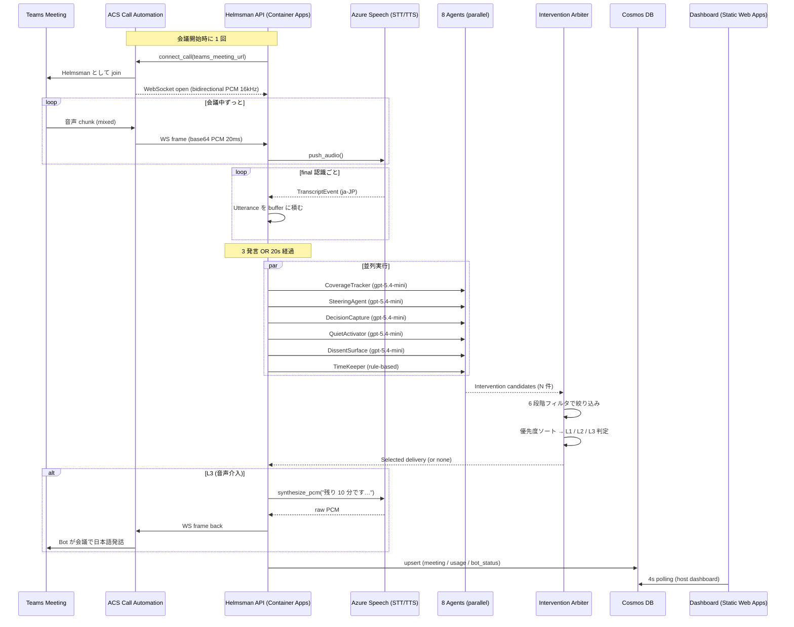
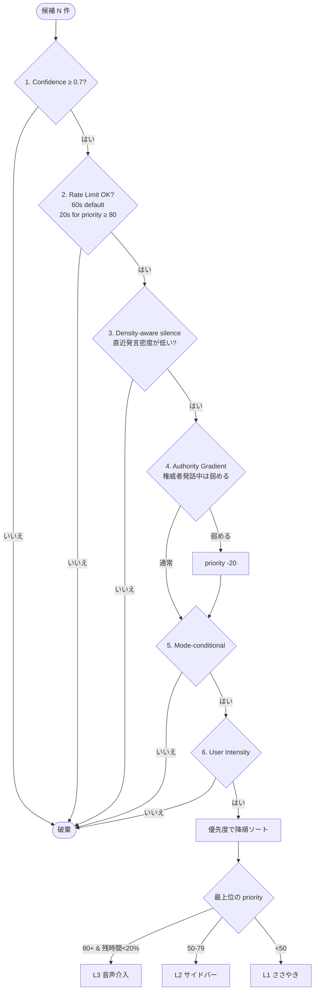
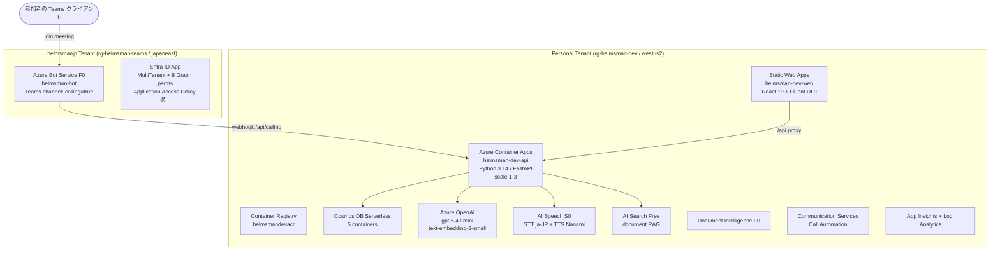

> Microsoft Agent Hackathon 2026 個人部門エントリ作品の開発記です。
> 議事録 AI の「次」って何だろう、と考え続けた結果、「会議そのものを成功させる AI」というところにたどり着きました。
>
> この記事は **エンジニアじゃない方にも読んでもらえるように** 書いています。技術的な話は折りたたみにしてあるので、気になるところだけ開いてもらえれば大丈夫です。

---

## 60 秒で、ぜんぶお伝えします

- **何を作ったか**: Microsoft Teams の会議に「Helmsman」という名前で参加して、議論をそっと見守ってくれる AI です。ここぞというときは、**会議の中で日本語の声で発言** までしてくれます。
- **いちばん伝えたいこと**: 偉い人がいると言いづらい反論、なかなか口を開けない人の意見、目上の人の事実誤認、「そろそろ時間ですよ」のひとこと ― **会議で人間がどうしても言いにくいことを、AI が代わりに言ってくれます**。
- **なぜ作ったか**: 議事録の AI(Otter / Fireflies / Teams の自動要約)は、もうかなり良いものが揃っています。でもそれって「うまくいかなかった会議を、あとからきれいに書き残してくれる」だけなんですよね。**会議が終わってからじゃなくて、会議の最中に手を入れる** ことが、次の一手なんじゃないかと思いました。
- **どう作ったか**: Azure の上で **10 個の AI** がそれぞれ違う観点から会議を見ていて、「司会の補佐役」がそれをまとめて、ちょうどいい強さで助け舟を出します。強さは「ささやき」「カード」「声で発言」の 3 段階です。**先週の会議で何を決めたか覚えていてくれる「記憶 AI」** と、**発言から「いま誰がどんな気持ちで話してるか」を読み取る「感情 AI」** も組み込みました。
- **使った技術**: Azure Container Apps / Azure OpenAI / Azure AI Speech / Azure Communication Services / Cosmos DB / AI Search / Static Web Apps / Bicep + GitHub Actions OIDC。Microsoft の技術を 8 種類使っています。
- **触れます**: 審査期間中(6/2-6/18)、どなたでも触れる状態にしています。
  - Frontend: https://kind-glacier-0122f6400.7.azurestaticapps.net
  - GitHub (MIT): https://github.com/nvidia9875/Helmsman
- **デモ動画 (3 分)**: [YouTube (差し替え予定)](https://youtu.be/REPLACE_ME)

---

## まずは 3 分の動画を見てもらえると嬉しいです

@[youtube](REPLACE_ME)

> 動画のだいたいの流れ:
> - 0:00 月次役員会(物理 3 名 + Teams 2 名)がスタート
> - 0:30 Helmsman bot が会議に入ってきて、「今日決めたいこと」を 5 つに分けます
> - 1:00 ずっと黙っていたリモートの方に、bot が声をかけます
> - 1:30 「全員賛成」の空気を察知して、「他の視点はありますか?」と問いかけ
> - 2:20 残り 8 分、bot が会議で日本語の音声で「撤退基準を決めましょう」と発言
> - 2:55 60 分で 5 つの論点ぜんぶ決着、決定 10 件がそのまま Planner に流れていきます

---

## 1. 議事録の AI は、もう十分良いものができてます。じゃあ次は?

ここ数年で、会議が **終わってから** 動く AI は、本当によくできるようになりました。

- **Microsoft Teams Premium** の Intelligent Recap が、発言を要約してアクションまで拾ってくれる
- **Otter / Fireflies / tl;dv / Fathom** が、文字起こしと要約をまとめてやってくれる
- **Notta / Read.ai** が、その場の雰囲気や盛り上がりまで可視化してくれる

でも、これって全部 **「会議が終わったあと、何が起きていたかをきれいに書き残す」** ものなんですよね。

> 議事録って、**うまくいかなかった会議の、うまくいかなかった様子を、ていねいに書き残してくれる**もの。でも、それだけだと「会議そのもの」はうまくいかないままで終わっちゃう。

会議のあとに「あ、Aの話、結局決まってなかったね」と気づいても、もう一回集まるしかない。**結局、時間は増えちゃう** んです。

### 1.1 会議が「うまくいかない」4 つのパターン

実際の現場でよく起きる失敗は、だいたい 4 つに分けられます。

| こんなことありませんか? | 何が起きるか | 今までの議事録 AI は助けてくれる? |
|---|---|---|
| **話が脱線してそのまま** | 「Aの話してたら派生でBが出てきて、Bが盛り上がってAは未決のまま終了」 | 「Aは未決でした」と書き残してくれるだけ |
| **時間が足りない** | 5 つ議題があったのに、最初の 2 つで 50 分使って、残り 3 つは雑に決まる | 「議論が足りませんでした」と書かれるだけ |
| **言いたいことを飲み込んでしまう** | 役員が方針を出したあと、みんなが「いいですね」連鎖、後日になって「実は…」 | "全員賛成" として残ってしまう |
| **目上の人の勘違いを訂正できない** | 偉い人の発言が事実と違っても、その場で訂正できる人がいない | 議事録には「正しいこと」として残り、後日になってズレが見つかる |

これって、**会議の最中じゃないと、もう手遅れ** なんです。あとから気づいても遅い。

なかでも **「目上の人の勘違いを訂正できない」** は、日本の組織でいちばん辛くて、いちばん解きづらい問題だと感じています。これを「AI に代わりに言ってもらおう」というのが、Helmsman でいちばん大事にしているところです。

---

## 2. ここがいちばんお伝えしたい ― 会議で人間が「言いにくい」4 つのこと

技術の話よりも先に、まずこの話をさせてください。

### 2.1 冷静に考えると、人間ってけっこう言えないことがある

日本の会議で、私たちが **「言いたいけど、なかなか言えない」こと** は、だいたい 4 つあります。

1. **目上の人への反論** ― 「部長、それ違うと思います」って、なかなか言えないですよね
2. **黙っている自分の意見** ― 「あの、僕も意見があって…」って、割って入るタイミングがつかめない
3. **目上の人の勘違いの指摘** ― 「先ほどの数字、資料と違ってませんか?」って、けっこう勇気が要る
4. **「そろそろ時間ですよ」のひとこと** ― 議長を急かすのって、ちょっと角が立つ

これって、その人が弱いから言えないわけじゃなくて、**そういう仕組みになっちゃってる** んです。心理的安全性の高いチームでも、相手が CxO クラスになると、人間はやっぱり本能的に言いにくくなります。Google の Project Aristotle(2015 年の有名な研究)も、「心理的安全性が高い」=「自由に言える」じゃなくて、「**失敗を共有しても傷つかない**」と定義していて、立場の上下による言いにくさは、また別の問題として残るんです。

### 2.2 AI に代わりに言ってもらえば、誰も気まずくならない

そこで Helmsman は、**AI に代わりに言ってもらう** ことで、誰も気まずくならない仕組みを作りました。

| 言いにくいこと | Helmsman が代わりにやってくれること | なぜ AI が言うと角が立たないのか |
|---|---|---|
| **目上の人への反論** | 「いいですね」連鎖を見つけたら、「他に検討すべき視点はありますか?」と、誰の発言かは伏せて問いかけ | 人じゃなくて **AI が機械的に判断したこと** なので、誰かが反対したことにならない |
| **黙っている自分の意見** | 発言量が少ない人を見つけて、「○○さん、いかがですか」とそっと声をかける | 「AI に振られた」というクッションがあるから、本人が割って入らなくて済む |
| **目上の人の勘違い** | 事前にもらった資料と発言の食い違いを見つけて、「戦略 Memo と違うかもしれません」と提示 | AI が **資料と機械的に照合した結果** として出るので、誰が指摘したかは消える |
| **「そろそろ時間です」** | 残り時間が少なくなったら、bot が会議で「残り 10 分です、撤退ラインを決めましょう」と発言 | 議長が時間管理の責任を **AI と一緒に背負える**。「Helmsman に言わせる」って言い訳ができる |

> **大事なこと**: これは「人間の代わりに AI が決める」じゃありません。**「人間が言いたいことを、AI が言ってくれる」** だけです。決めるのは、ずっと人間のままです。Helmsman は、ただ「言いにくさ」をやわらげる役回りなんです。

### 2.3 もし会議中に言えなくても、レポートにはちゃんと残ります

会議中に間が悪くて言えなかったことも、**会議が終わったあとのレポート** にはちゃんと残るようにしています。

たとえば「9 月 15 日にローンチで決定」という結論には、こんなふうに細かい情報がついてきます。

- 決まったこと: 9 月 15 日にローンチで決定
- そう決まった瞬間: (0:48:12) 山田 CTO: 「9 月 15 日で行きましょう」
- **まだ気になっていること**: (0:42:30) 高橋さん: 「QA 期間が 2 週間短いかも」→ **解消されないまま決まった**
- **資料との食い違い**: Q3 戦略 Memo では 9 月 30 日が前提 → スケジュール調整が要りそう

つまり、会議中に言えなかったモヤモヤも、資料との食い違いも、**最後のレポートには必ず書き残されます**。

> **だから、「会議中に言えなかった自分」を責めなくていいんです。AI が見ていてくれます。これが Helmsman の、ちいさな約束です。**

:::details エンジニア向け補足: Decision Capture の構造化スキーマ

```json
{
  "decision_id": "d_42",
  "topic_id": "launch_date",
  "decision_text": "9 月 15 日にローンチで決定",
  "evidence_quote": "(0:48:12) 山田 CTO: 9 月 15 日で行きましょう",
  "speaker": "p_yamada",
  "confidence": 0.92,
  "concerns_raised": [
    {
      "raised_at": "0:42:30",
      "raised_by": "p_takahashi",
      "concern": "QA フェーズが 2 週短い可能性",
      "addressed": false,
      "note": "決定時点で未解消。後続会議で扱う必要あり"
    }
  ],
  "document_conflicts": [
    {
      "source": "Q3 戦略 Memo - 開発スケジュール",
      "conflict": "Memo では 9 月 30 日ローンチ前提だが、会議では 9 月 15 日に前倒し決定"
    }
  ]
}
```

`evidence_quote` は **実発言の substring match を機械的に検証** していて、LLM が幻覚で発言を作っても落とされる設計です。

:::

### 2.4 でも、便利だからって使いすぎたら、たぶん人間関係が壊れます

ここまで「AI に言ってもらえばいいじゃん」みたいに書いてきましたが、当然、**使いすぎたら逆に人間関係が壊れます**。

なので、こんな歯止めを入れています。

- **目上の人が話しているときは、AI もちょっと黙る**: 「AI に言わせる」を「AI で攻撃する」にしないため
- **どれくらい口を出すかは、主催者が選べる**: 「おとなしめ」「ふつう」「積極的」の 3 段階
- **誰の意見かは伏せる**: 反対意見の代弁は、必ず匿名で
- **議論が盛り上がってるときは黙る**: 「議論を促す」と「議論を止める」を、ちゃんと分ける

> **AI は「言いにくいことを言う」役は引き受けるけど、「人間関係を壊す」役までは引き受けない**。この境界線を、あとで出てくる「司会の補佐役」がちゃんと守ってくれます。

---

## 3. Helmsman って中身どうなってるの?

ここから少しずつ、中身の話に入っていきます。技術的なところは折りたたみに入れたので、気になるところだけ開いてくださいね。

### 3.1 全体像 ― 10 人の観察役と、1 人の司会補佐

Helmsman は、会議を見守る **10 人の役割分担された AI** と、そのみんなの声をまとめる **1 人の司会補佐** でできています。

人間のチームに置き換えると、こんな感じです。

| Helmsman の役回り | 人間で言うと |
|---|---|
| **ゴール分解係** | 冒頭で「今日決めたいことを 5 つに分けますね」と整理してくれる人 |
| **進捗チェック係** | どの議題が終わったか、ノートに印をつけてくれる人 |
| **舵取り係** | 話が脱線したら、「えーと、本題に戻ると…」と戻してくれる人 |
| **決定の記録係** | 「いま 9/15 ローンチで決まりましたね」と確認してくれる人 |
| **声かけ係** | 黙ってる人に「○○さん、どう思います?」とふってくれる人 |
| **そっと一石を投じる係** | 全員賛成の空気に「他にリスクはないかな?」と聞いてくれる人 |
| **時間係** | 「残り 10 分です」と時計を見ていてくれる人 |
| **記憶係** 📜 (Phase 7) | 「前回の会議で X さん、これを ¥1200 で決めたんでしたよね」と思い出させてくれる人 |
| **空気読み係** 🌡 (Phase 8) | 「○○さん、少し懸念がにじんでる発言が続いてます」と発言の温度感を見てくれる人 (カメラは使わない) |
| **司会補佐** | 上の 9 人の発言をまとめて、「いま誰に何を言ってもらうか」を決める人 |

これ、実際の会議で **1 人の人間が全部やるのは、まあ無理** なんですよね。だからこそ「AI に並列でやってもらおう」というのが、Helmsman を作った素直な動機です。

:::details エンジニア向け補足: 10 エージェントの tier と並列実行

| Agent | 種別 | LLM tier (本番) |
|---|---|---|
| Goal Decomposer | LLM | gpt-5.4 |
| Coverage Tracker | LLM | gpt-5.4-mini |
| Steering Agent | LLM | gpt-5.4-mini |
| Decision Capture | LLM | gpt-5.4-mini |
| Quiet Activator | LLM | gpt-5.4-mini |
| Dissent Surface | LLM | gpt-5.4-mini |
| **Memory Retriever** (Phase 7) | LLM + embedding + vector search | gpt-5.4-mini + text-embedding-3-small |
| **Tone Agent** (Phase 8) | LLM (発言テキスト → 感情ラベル + sentiment 分類、cache hit でスキップ) | gpt-5.4-mini |
| TimeKeeper | Rule-based | (LLM 不要) |
| Intervention Arbiter | Rule-based | (LLM 不要) |

並列実行は `asyncio.gather` でシンプルに:

```python
async def run_tick(meeting: Meeting) -> list[InterventionCandidate]:
    coverage, steering, decision, quiet, dissent, memory, tone = await asyncio.gather(
        coverage_tracker.run(meeting),
        steering_agent.run(meeting),
        decision_capture.run(meeting),
        quiet_activator.run(meeting),
        dissent_surface.run(meeting),
        memory_retriever.run(meeting),       # Phase 7
        tone_agent.run(meeting, participants=...),  # Phase 8
    )
    timekeep = timekeeper.run(meeting)
    candidates = flatten([coverage, steering, decision, quiet, dissent, memory, tone, timekeep])
    return arbiter.decide(candidates, now=meeting.audio_time)
```

実測平均レイテンシ **2.08 秒 / tick** (LLM 7 並列、20 秒に 1 回発火)。ToneAgent は分類済 utterance をキャッシュするので 2 回目以降はその発言に対する LLM 呼び出しが省略され、tick あたりのコスト追加は ~$0.0006 にとどまります。1 会議あたりの実コストは $0.03 程度。

:::

### 3.2 1 回の会議の流れ ― 20 秒に 1 回、会議を見て、考えて、ちょっと動く

会議が始まると、Helmsman bot は Teams に入って、音声を文字に起こしながら **20 秒に 1 回くらいのペースで** 「いま会議で何が起きてるかな」を見ています。

ざっくり、1 サイクルはこんな流れです。

1. 直近 20 秒の発言を、8 人の観察役みんなに渡す
2. みんなが同時に「気になったこと」を出してくる(「Aは決まった」「○○さんが黙りすぎ」みたいに)
3. 司会補佐が「いま助け舟を出すべきか? 出すならどれくらいの強さで?」を決める
4. 助け舟を出すと決まったら、ささやき / カード / 声 のどれかで届ける
5. 全部 Cosmos DB に記録して、ダッシュボードにも反映する

これを 60 分の会議で **最大 180 回** くらい繰り返しています。

:::details エンジニア向け補足: Tick サイクル全体図



「tick」は会議を一定リズムで観察する周期処理です。**3 発言溜まる or 20 秒経過** で 1 tick を回し、1 tick で 5-6 個の LLM 推論を並列実行します。

:::

### 3.3 司会の補佐役 ― 6 つの問いを通って、ようやく助け舟が出ます

7 人の観察役が「助け舟を出したい!」と手を挙げても、それを全部やっちゃうと **会議が AI のおせっかいで埋め尽くされて、もう会議じゃなくなります**。

なので、司会補佐は **6 つの問い** で「ほんとに今、出すべきか?」を確かめます。

1. **どれくらい自信ある?** ― 「これは絶対にいま言わなきゃ」と確信があるものだけ通す
2. **さっき似たやつ出してない?** ― 同じ種類の助け舟が連発しないように
3. **議論、盛り上がってない?** ― 盛り上がってるところに割り込まない(意外と大事 ↓)
4. **目上の人が話してない?** ― 話してるなら、「黙ってる人にふる」系はちょっと弱める
5. **会議のモードに合ってる?** ― 「決める会議」でブレストっぽい提案を出さない
6. **主催者の好みは?** ― 「おとなしめ / ふつう / 積極的」の設定に合わせる

#### 3.3.1 「盛り上がってる時には黙る」が、意外と大事です

「**発言が途切れたら助け舟を出す**」って、実は技術的にいちばん簡単なんです。タイマーで測ればいいだけ。でも、**これがいちばん嫌がられる** ことに気づきました。

理由はシンプルで、人間にとっての沈黙って、**「考えてる時間」** なんですよね。考えてるところに AI が「失礼します」って入ってきたら、流れがプツッと切れちゃいます。

なので Helmsman は逆をやっていて、**直近 30 秒の発言の密度** を見て、密度が **低いとき = みんなが行き詰まってるっぽいとき** だけ助け舟を出すようにしています。「活発な議論には黙って、行き詰まったら出てくる」という感じです。

:::details エンジニア向け補足: Density-aware filter の実装

```python
def density_aware_filter(candidate, recent_utterances, now):
    window_30s = [u for u in recent_utterances if now - u.timestamp < 30]
    density = sum(len(u.text) for u in window_30s) / 30  # chars/sec

    # 議論が活発 (3 chars/sec 以上) なら割り込まない
    if density > 3.0:
        return None  # drop

    return candidate
```

直近 30 秒の発言密度を計算し、しきい値を超えていたら drop。eval (25 分会議) では Arbiter acceptance 45.5% (33 候補 → 15 配信)。density フィルタを抜くとノイズが増える想定で、Phase E でリアル派遣時にユーザー認知実験予定。

:::

#### 3.3.2 目上の人が話しているとき、AI も気を遣います

§2.4 で書いた「AI で攻撃しないように気をつける」を、ちゃんと守るための仕組みが **「目上の人が話してる?」の問い** です。役員クラスの人が長く話しているときは、「黙ってる人にふる」系の助け舟をちょっと弱めます。

これ、**プロンプトと司会補佐の二段構え** にしています。万が一プロンプトが効かなくなっても、構造側で守れる設計です。

:::details エンジニア向け補足: Authority Gradient filter

```python
def authority_gradient_filter(candidate, participants, current_speaker, now):
    if candidate.kind not in {"quiet_activator", "dissent_surface"}:
        return candidate

    senior_speaking = participants.get(current_speaker, {}).get("is_senior", False)
    speaking_duration = now - current_speaker_started_at

    if senior_speaking and speaking_duration > 30:
        candidate.priority -= 20  # 即 drop ではなく弱める
        if candidate.priority < 50:
            return None

    return candidate
```

:::

:::details エンジニア向け補足: Arbiter 6 段フィルタの全体フロー



実装は約 280 行 + テスト 17 件。CHI 2025 の "Observe, Ask, Intervene" フレームの **future work (介入タイミングの具体化)** を実装で埋めた位置にあります。

:::

### 3.4 助け舟の強さは 3 段階 ― 「ささやき / カード / 声」

Helmsman の助け舟には、**おせっかい度の違う 3 段階** があります。

- **① ささやき** ― 主催者の画面にだけ、そっと表示します。他の人には見えません。「あ、○○さん黙ってますね」みたいな、軽い気づき。
- **② カード** ― 全員の画面に、控えめなカードで届けます。「他に検討すべき視点はありますか?」みたいな、ふんわりした問いかけ。
- **③ 声** ― ここが本気のところ。bot が **会議で実際に日本語の声で発言** します。「残り 10 分です、撤退ラインを決めましょう」みたいな、ここぞというときだけ。

③ はデモを見ていただくといちばんびっくりする瞬間です。**「AI が会議で声で喋る」** って、最初に見ると本当に「えっ」ってなります。声は Azure Speech の `ja-JP-NanamiNeural` を使っていて、聞いていて違和感のない自然な日本語のイントネーションで話してくれます。

> ちなみに、この「見守る → そっと聞く → 声に出す」の段階分けは、CHI 2025 という学会で発表された "Observe, Ask, Intervene" というフレームに対応しています。① と ② が "Ask"(人間に確認する)、③ が "Intervene"(実行する)です。

---

## 4. 会議が終わったあとも、AI はちゃんと働いてくれます ― レポート生成

会議が終わったら、Helmsman は **会議のレポート** を作ってくれます。「もう一回タイプし直すの、面倒くさいな」をなくしたかったんです。

### 4.1 3 つの使い方

| こんな日には | 入力するもの | Helmsman の仕事 |
|---|---|---|
| **会社の議事録テンプレが決まってる** | テンプレ(markdown 形式)を貼る | 会社のフォーマットに合わせて自動で埋める。決定の根拠も `> 引用` で添える |
| **会議中に手元でメモしてた** | 手書きメモを貼る | メモを最優先に取り込みつつ、Helmsman の構造化結果で足りないところを補う。食い違いは「要確認」と明示 |
| **メモ取る余裕なかった** | 何も入れなくて OK | 標準の 6 章構成(サマリ / ゴール / 決定 / 未解決 / ネクスト / 資料との齟齬)で書き出す |

### 4.2 「どの情報をいちばん信じるか」の順番をはっきり決めてあります

レポートを作るとき、AI は 3 つの情報源を持っています。

1. **あなたのメモ** ― いちばん信じる(人間が手で書いたものだから)
2. **Helmsman が会議中に集めた結果** ― 各論点の決定と、その根拠の発言
3. **会議の発言ログそのもの** ― 任意で渡せば、おまけの情報として参照

これらが食い違ったときは、**両方を並べて「「事実関係要確認」」と書く** ようにしています。AI が勝手にどっちかを採用しません。

:::details エンジニア向け補足: レポート生成プロンプトの「推測禁止」ルール

```python
SYSTEM_PROMPT = """\
あなたは Helmsman の会議レポート生成 Agent です。
会議コンテキストとユーザー提供の補助入力 (任意のテンプレート / メモ) から、
構造化された markdown レポートを生成します。

ルール:
1. テンプレートが与えられた場合、その章立て・トーン・フォーマットを厳守
2. メモが与えられた場合、そこに書かれた事実・所感は **権威ある情報源** として尊重
   - メモと会議ログが矛盾する場合、両方を提示して「「事実関係要確認」」を明示
3. テンプレもメモも無い場合、デフォルト構成で出力
4. 決定事項は必ず evidence_quote を `> 引用` で添える
5. 推測で事実を書かない。確実な情報源 (topics / interventions / 発言ログ / メモ)
   に基づくものだけ。曖昧な場合は「要確認」を明示
"""
```

**ハマったポイント**: 最初は「memo を最優先」とだけ書いていたら、LLM が memo に書かれていない決定事項を memo 由来として書いてしまうケースが発生。**「ルール #5: 推測で事実を書かない」を追加** したら、「メモ中の『山田 CTO』の役職情報は会議コンテキストに明示がないため、肩書きは要確認です」のように **不確実な部分まで検証** してくれるようになりました。

:::

レポート 1 通は **6-10 秒、だいたい $0.01 で完成** します。会議 1 本($0.03 想定)と合わせても **$0.04 / 会議** くらいで済む計算です(数値は実測中)。

---

## 5. 他の Meeting AI とは、ちょっと立ち位置が違います

世界の主要な Meeting AI を、**「タイミング(終わったあと ← → リアルタイム)」と「動き方(見るだけ ← → 助け舟を出す)」** の 2 つの軸で並べると、ぽっかり空いている場所が見えてきます。

:::details エンジニア向け補足: 2026 Meeting AI 製品マップ (mermaid)

```mermaid
quadrantChart
    title 2026 AI Meeting プロダクトマップ (公開機能ベースで筆者整理)
    x-axis 事後分析 --> リアルタイム
    y-axis 受動 (観測のみ) --> 能動 (介入する)
    quadrant-1 "リアルタイム × 能動"
    quadrant-2 "事後 × 能動"
    quadrant-3 "事後 × 受動 (既存議事録 AI の主戦場)"
    quadrant-4 "リアルタイム × 受動"
    Granola: [0.15, 0.20]
    Otter: [0.30, 0.28]
    Fathom: [0.18, 0.22]
    Fireflies: [0.20, 0.20]
    tl;dv: [0.18, 0.18]
    Sembly: [0.25, 0.35]
    Read.ai: [0.55, 0.45]
    MS Facilitator: [0.60, 0.50]
    Cluely: [0.75, 0.55]
    Helmsman: [0.85, 0.90]
```

:::

ざっくり言うと、こんな感じです。

- **左下(終わったあと × 見るだけ)** = Granola / Otter / Fathom / Fireflies / tl;dv / Sembly。**もう成熟しているところ**。要約も検索もアクション抽出もよくできてます。
- **右下(リアルタイム × 見るだけ)** = ほぼ空白。可視化までで止まってるイメージ
- **右上(リアルタイム × 助け舟を出す)** = Cluely(個人向けの sales coach)/ MS Facilitator(テキスト中心)/ Read.ai(雰囲気の可視化)が、薄く存在
- **Helmsman は、ここに「8 人並列で見守る + 3 段階の助け舟 + 音声で発言」まで踏み込んだ、わりと珍しい立ち位置です**

### 5.1 代表 4 製品との比べ方

| 観点 | Granola | Cluely | Read.ai | MS Facilitator | **Helmsman** |
|---|---|---|---|---|---|
| **主に何のため?** | 個人の議事録(あとから要約) | 個人の商談コーチ | 会議の雰囲気の可視化 | Teams 会議の補佐(テキスト) | チーム会議の能動的な助け舟 |
| **いつ動く?** | 会議のあと | 会議中 | 会議中 + あと | 会議中 + あと | 会議中 |
| **誰に届く?** | 自分だけ | 自分だけ | 主催者 | 会議の chat | **主催者 / 全員 / 声で全員** |
| **声で喋る?** | なし | なし | なし | なし | あり(Azure TTS の Nanami) |
| **公開価格** | $0 / $14-35 | $19 / $49 | $0 / $19.75 | M365 Copilot $30 + | Azure 従量(実測 TBD) |
| **配布** | クローズド | クローズド | クローズド | クローズド | **MIT のオープンソース** |

> 各社のプロダクトは、Helmsman とは **ちょっと違うカテゴリ(事後/個人コーチ/分析)で、それぞれよくできてます**。なので、この表は「どっちが上」じゃなくて、「立ち位置が違うんだな」と思って見ていただけると嬉しいです。

### 5.2 Helmsman を選びたくなるのは、こんなとき

- 複数人の会議で、**ちゃんと助け舟を出してほしい**(Granola や Read.ai は、見守るところまで)
- **声で言ってほしい**(Cluely や Facilitator は文字が中心)
- **外の人も参加する会議**(Facilitator は M365 Copilot のライセンスがある人にしか効かない)
- **オープンソースで自分でカスタマイズしたい**(上の 4 つは全部クローズド)

---

## 6. 参加者に怖がられないように、ちゃんと気を遣ってます

会議に AI が入ると、参加者はやっぱり「えっ、ちょっと大丈夫?」って思います。Helmsman は、Microsoft の Responsible AI Standard v2 という指針の 6 つの原則に沿って、ひとつずつ気を配っています。

| 原則 | Helmsman でやっていること |
|---|---|
| **公平性** | 発言量に偏りがあれば、声かけ役がそっと声をかける。同意の連鎖を見つけたら、別の視点をひとこと添える |
| **信頼性と安全性** | 「決まった」と AI が判断するときは、必ず根拠になる発言の **そのままの言葉** を引用させる(AI のつくり話を構造的に防ぐ) |
| **プライバシー** | 音声と文字起こしは **会議終了 30 日で自動で消える**。声紋データの保存は、ご本人がはっきり同意したときだけ |
| **包摂性** | 立場の上下を尊重しつつ、助け舟の強さ(ささやき / カード / 声)は主催者が選べる |
| **透明性** | 助け舟にはぜんぶ「どの観察役が、何を見てそう言ったか」が添えてあります。ダッシュボードでも見られます |
| **説明責任** | LLM の呼び出しは全部 Application Insights に記録、コストもかかった時間も毎日まとめて見られる |

会議に入る前には、**「Helmsman が入ります」というお知らせダイアログ** を出して、参加者に同意してもらいます。EU AI Act や改正個人情報保護法も意識した設計です。

---

## 7. どれくらい効くのか(計測中)

_(いま測っているところです。確定したら追記します。Before / After の比較、コストの内訳、応答時間のばらつき、などを 25 分の実会議で取る予定です)_

---

## 8. 中で使っている技術 ― なぜこの組み合わせ?

ハッカソンの必須要件「Azure の実行基盤 + Microsoft の AI 技術 を最低 1 つずつ」に対して、**8 つのサービスを重ねて** 満たしています。

| ハッカソンの要件 | Helmsman での対応 |
|---|---|
| **Azure 実行基盤** どれか必須 | Azure Container Apps (backend) + Static Web Apps (frontend) |
| **Microsoft AI 技術** どれか必須 | Azure OpenAI (gpt-5.4 / mini) + Azure AI Speech (STT/TTS) |
| Cosmos DB 推奨 | Serverless で 5 つの container |
| GitHub Copilot 推奨 | 開発の全工程で使ってます |
| Power Platform 推奨 | 決定 → Power Automate 経由で Planner に流す(Phase 8) |
| Microsoft Entra ID 推奨 | Bot Framework 認証 + GitHub Actions OIDC |

:::details エンジニア向け補足: 物理コンテナ構成 (2 テナント構成)



**2 テナント構成にした理由**: Teams 会議への bot 派遣には正規 Teams テナント(Teams Essentials 以上)が必要。一方、既存の Azure 基盤は personal tenant にあった。両方を活かすために、**personal で Container Apps を動かしたまま、helmsmanjp の Entra ID app の認証情報を環境変数で渡す** ハイブリッド構成にしました。

:::

:::details エンジニア向け補足: 開発で「あちゃー」ってなった瞬間 4 連発

実装で本当に痛かったのは、論文化を狙えそうな Arbiter 設計ではなく、もっと泥臭い 4 つの瞬間でした。

| # | 何を間違えたか | 効いた修正 |
|---|---|---|
| 1 | **Arbiter rate_limit が wall-clock 依存** ― offline replay で 25 分会議を 70 秒で再生したら 2 件目以降が全部 drop | `decide(now=...)` で時刻 inject、eval は audio_time を渡す |
| 2 | **「高い tier = 高品質」と信じていた** ― gpt-5.4 (HIGH) で動かしていたら cheap (mini) のほうが decisions 2×、コスト 1/6 で勝ってしまった | 全 agent 毎に tier を選べる設計に統一、本番推奨を `--cheap` に格上げ |
| 3 | **ACS の `TeamsMeetingLinkLocator` が SDK 全バージョンに存在しない** ― Microsoft 公式 docs を信じて実装、本番 ImportError | Service-hosted Graph Calling Bot に方針転換、Application Access Policy を PowerShell で設定 |
| 4 | **Decision Capture が memo を過信** ― memo に書かれていない決定を memo 由来として書く幻覚 | 「ルール #5: 推測で事実を書かない」追加 |

**学び**: Agentic AI のデバッグは「LLM がおかしい」ではなく **「人間側の制御設計がおかしい」** ケースのほうがずっと多いです。

:::

:::details エンジニア向け補足: テスト戦略 (89 unit + eval harness)

「Agentic AI は確率的だからテスト書けない」は半分嘘で、**2 階建て** でテスト rigor を維持しています。

| レイヤ | 件数 | 実行時間 | 何を保証するか |
|---|---:|---:|---|
| unit test (pytest) | 89 件 | ~0.45 秒 | 純粋ロジック (Arbiter フィルタ / TimeKeeper / pricing / FSM 遷移 / Report agent) |
| integration test | 6 件 | ~3 秒 | FastAPI routes (mocked Cosmos / Azure SDK) |
| **eval harness** | run-on-demand | 60-90 秒 | **8 agents 全体の behavior**。fixed transcript を input、決定捕捉数・介入数・コストを assert |

特に **eval harness を回帰テストにする** のが効きました。

```bash
# プロンプト変更後、必ず以下を実行
uv run python scripts/eval_offline.py \
    --transcript eval_runs/baseline/utterances.jsonl \
    --goal "<会議のゴール>" --cheap --label PR-$PR_NUMBER

python scripts/eval_diff.py eval_runs/baseline eval_runs/PR-$PR_NUMBER \
    --max-decision-loss 1 --max-cost-increase 0.01
```

これで **「プロンプト改善が局所的に良くなって全体で悪化」** という Agentic AI で頻発する事故を防げます。

:::

:::details エンジニア向け補足: CI/CD は Bicep + GitHub Actions OIDC でシークレットレス

`.github/workflows/api-deploy.yml`:

```yaml
permissions:
  id-token: write  # OIDC 必須
  contents: read

jobs:
  deploy:
    runs-on: ubuntu-latest
    steps:
      - uses: azure/login@v2
        with:
          client-id: ${{ secrets.AZURE_CLIENT_ID }}
          tenant-id: ${{ secrets.AZURE_TENANT_ID }}
          subscription-id: ${{ secrets.AZURE_SUBSCRIPTION_ID }}
      - run: |
          az acr build -r helmsmandevacr -t helmsman-api:${{ github.sha }} .
          az containerapp update -n helmsman-dev-api -g rg-helmsman-dev \
            --image helmsmandevacr.azurecr.io/helmsman-api:${{ github.sha }}
```

**シークレットレスにした理由**: 個人開発の `.env` を間違って push する事故を構造的に防ぐため。Federated Credential は GitHub の OIDC token を Entra ID 側で検証するので、long-lived な service principal secret が一切存在しません。

:::

---

## 9. これからやっていきたいこと

| Phase | 何をやるか | いつ |
|---|---|---|
| ~~**Phase 7: 会議をまたいで記憶する**~~ | ~~週次の連続会議で「あの時こう決めましたよね」を横断的に探せる~~ | ✅ **実装済 (2026-05)** |
| ~~**Phase 8: 感情・温度感を読む(発言ベース)**~~ | ~~発言テキストから一人ひとりの感情を読み取り、会議全体の温度感もダッシュボードに表示~~ | ✅ **実装済 (2026-05)** |
| **Phase 9: Power Automate と仲良くなる** | 決定がそのまま Planner / Loop / DevOps の Work Item に流れる | 2026 Q4 |
| **Phase 10: 組織全体に広げる** | 「同じ論点を別チームでも話してるかも」に気づける | 2027 Q1 |

### 9.1 ✅ Phase 7: 会議をまたいで記憶する(実装済 2026-05)

シリーズ会議 (毎週の定例)、グループ会議 (同じプロジェクト) を超えて、過去の決定を引いてきます。9 番目の agent **MemoryRetriever** が担当。

仕組み (2 段構成):

1. **DecisionCapture が確定させた決定** を、リアルタイムで Cosmos と Azure AI Search に write-through で保存(text-embedding-3-small で 1536 次元ベクトル化)
2. 次の会議の議論中、現在のトピックを embed → AI Search の HNSW vector index で類似決定を上位 5 件取得 → MINI モデルが「今表に出すべきか」を判断 → 介入候補に

スコープと絞り込み:

- 主催者 (organizer) ごとに分離 (他人の決定は見えない)
- 同 series_id (定例会議) なら +0.30 スコアブースト
- 同 group_id (プロジェクト) なら +0.15
- 90 日経つと linear で減衰

「History」ページに自然言語検索バーがあって、**「あの時 X 決めたやつ」** と書くだけでベクトル類似で並べてくれます。1 件 1 件、元の会議へリンクで戻れます。

**AI Search が無くても動く**ように、numpy 経由の in-process cosine フォールバックを最初から実装しました(個人 organizer の決定数なら全件 scan でも < 50ms、許容範囲)。

### 9.2 ✅ Phase 8: 発言から感情を読む(実装済 2026-05)

「いま誰がどんな気持ちで話してるか」をダッシュボードで見えるようにしました。10 番目の agent **ToneAgent** が担当します。

**設計判断**: いったんカメラ + MediaPipe による顔シグナルも作っていましたが、撤去しました。理由は 2 つで、(1) Teams 会議全員の映像を bot から取るには C# media SDK + Windows host が必要で、Python の既存基盤と合わない、(2) ダッシュボードを開いてカメラを ON にしてくれる参加者を当てにできない。「発言テキストは Bot が取れてるんだから、そこから感情を読めばいい」というシンプルな割り切りで、**カメラを一切使わずに済む** 設計に振り直しました。

#### どんな信号を取っているか

各発言テキストに対して、LLM (gpt-5.4-mini) が以下の 6 ラベルから 1 つだけ選びます。

| ラベル | 何を見ているか | 例 |
|---|---|---|
| **joy** 😊 | 楽観・喜び・熱意 | 「これ、すごく良いと思います」 |
| **agreement** 👍 | 賛同・受容・合意 | 「はい、それで進めましょう」 |
| **curiosity** 🤔 | 問いかけ・探求・興味 | 「なぜそうなるんでしたっけ?」 |
| **concern** 😕 | 懸念・困惑・不安 | 「ちょっと心配な点があって…」 |
| **frustration** 😤 | 苛立ち・行き詰まり・否定 | 「いや、それじゃ無理です」 |
| **neutral** 😐 | 事実陳述・無感情 | 「今週は 3 件、対応しました」 |

合わせて -1.0 〜 +1.0 の **sentiment スコア** も推定します。

#### 全体の温度感 (Mood)

話者ごとの感情を集めて、会議全体を 4 つの mood に分類してダッシュボードで可視化します。判定は単純なルールベースです。

| Mood | 判定条件 | 出す signal |
|---|---|---|
| **TENSE** ⚠ | concern + frustration が 40% 以上 | 緊張・困惑のサインが多い |
| **ALIGNED** ✦ | agreement が 30% 以上 + sentiment > 0.2 | 合意が積み上がっている |
| **ENERGETIC** ⚡ | joy + curiosity が 40% 以上 | 探求と熱量が出ている |
| **STUCK** ~ | 上記いずれにも当てはまらない | 中立発言が続いている、空気が止まっている |

#### ダッシュボードでの見え方

- **LiveTranscript**: 各発言の右に絵文字バッジ ("👍 賛同" "😕 懸念" 等) と話者名
- **ParticipantsPanel**: 話者ごとに「主に積極的 😊」「困惑気味 😕」などの傾向、直近 8 発言の感情ストリーム (色付きドット)、最新の発言テキスト
- **Mood meter**: ヘッダーに `⚠ TENSE` のような今の状態ラベル + sentiment スライダー (-1 〜 +1)

#### 介入のトリガー

ToneAgent 自身も 1 つだけ介入候補を出します: **直近 8 発言の 50% 以上が concern/frustration かつ 45 秒以上沈黙が続く** → 「議論が少し止まっているようです。引っかかっている点を一度言葉にしてみませんか?」を Arbiter に投げ、L2 で発火 (priority 55 + 20 boost = Steering と同等扱い)。

#### プライバシー

カメラ・マイクの追加収集は一切ありません。すでに Bot が文字起こしのために受け取っている発言テキストを LLM に渡して感情ラベルを得るだけです。**新しい個人データを増やさない**、というのが Phase 6 (カメラ) を撤去して Phase 8 に振り直した最大の理由です。発言テキスト自体は既存の 30 日 TTL ポリシーで自動削除されます。

:::details エンジニア向け補足: ToneAgent のキャッシュ戦略

`services/tone_buffer.py` で in-memory LRU (200 utt / meeting) を持っており、`utterance_id` で de-dup します。tick が 20 秒に 1 回走るたびに同じ発言を再分類しないよう、**未分類のものだけ抜き出して** LLM へ送ります (`get_unclassified_ids`)。

- 1 会議 60 発言なら 4 batch (各 15 件) で済む → コスト ~$0.003
- Container Apps の再起動でキャッシュは飛びますが、感情ラベルはレポート生成には使わずダッシュボード polling 専用なので、影響は live UI が一瞬空になるだけ
- Buffer は singleton。マルチプロセス worker になったときは Cosmos 永続化が必要

:::

:::details エンジニア向け補足: Phase 9 以降で検討中の Hume EVI 統合 (未実装)

いまの TTS は Azure Speech `ja-JP-NanamiNeural` の固定 prosody です。実会議では「議論が緊張している瞬間に明るすぎる声で介入する」と空気が崩れる懸念があり、声色を会議の状態と整合させる発展が必要だと考えています。

[Hume EVI (Empathic Voice Interface)](https://www.hume.ai/empathic-voice-interface) は会話の感情状態に応じて TTS prosody を動的に変調する API です。実装済 Phase 8 (ToneAgent) の発言感情シグナルと組み合わせると、Helmsman の介入は次の 3 軸で会議と同期します。

- **何を言うか** ← Arbiter (6 段フィルタ)
- **誰に向けて言うか** ← 代弁構造 + L1/L2/L3 グラデーション + 発言の温度感 (Phase 8 ✅)
- **どんな声色で言うか** ← Hume EVI (Phase 9 以降で検討中)

※ API 検証 / コスト試算 / 倫理レビュー(感情応答 TTS は別の Responsible AI 課題を生む)が未完のためロードマップ補足扱いです。

:::

---

## 10. 最後に

- 議事録の AI はもう成熟したけど、**「会議をその場で良くする AI」** はまだほとんど誰もやってない領域でした。Helmsman は、その空白に踏み込んだひとつの実装です。
- **いちばん大事にしたところ**: 会議で人間が **どうしても言いにくい 4 つのこと**(目上の人への反論 / 黙ってる人の意見 / 目上の人の勘違い / 時間切れの宣言)を、**AI が代わりに言ってくれる** ことで、誰も気まずくならない仕組みを作りました。
- **9 人の観察役 + 6 つの問いを通す司会補佐** という Agentic AI の作り方で、「いつ・誰に・どんな強さで助け舟を出すか」を、ちゃんと考えて出します。会議中に間に合わなかった懸念も、**最後のレポートには必ず残る** ようにしてあります。9 人の中には、**先週の決定を覚えていてくれる記憶係(Phase 7)** と、**発言の温度感を読む空気読み係(Phase 8、カメラ不使用)** も含まれています。
- 中身は Azure Container Apps / OpenAI / Speech / ACS / Cosmos / AI Search / Static Web Apps / Bicep + OIDC の Microsoft 主軸で、ハッカソンの必須要件を 8 サービスで多重に満たしています。
- 6/2-6/18 の審査期間中、ライブ環境を維持してます。**どなたでも触れます**。

---

## 触ってみてください / GitHub

- **試用** (審査員の方も気軽に): https://kind-glacier-0122f6400.7.azurestaticapps.net
- **GitHub** (MIT): https://github.com/nvidia9875/Helmsman
- **API ドキュメント**: https://helmsman-dev-api.ashyocean-e634ae12.westus2.azurecontainerapps.io/docs
- **作者**: [@nvidia9875](https://github.com/nvidia9875)

---

## Appendix A: よく聞かれそうな質問

### Q1. AI が会議で喋るのって、怖くないですか?

A. 怖くないように作ってます。Helmsman は **「言いにくいことを言う」だけで、何かを決めることはありません**。決めるのはいつも人間です。助け舟の頻度も、主催者が「おとなしめ / ふつう / 積極的」で選べます。

### Q2. プライバシーは大丈夫ですか?

A. 会議に入る前に **「Helmsman が入ります」というお知らせ** を出して、全員に同意してもらいます。音声と文字起こしは **30 日で自動で消える** ので、いつまでも残ったりしません。声紋データを保存するのも、本人がはっきり同意したときだけです。

### Q3. Microsoft Teams Premium とのお値段、どう違いますか?

A. Teams Premium は ¥1,250/人/月 + M365 のベース料金。Helmsman は **1 人 ¥1,200/月くらいで同じ価値** を目指しています(細かい数字は実測待ちです)。

### Q4. 日本語以外でも使えますか?

A. Azure Speech と OpenAI は 100 以上の言語に対応してます。プロンプトの日本語部分(敬語など)を英語に差し替えれば、すぐ動きます。多言語の UI 対応は Phase 9 (組織展開) で取り組む予定です。

### Q5. 物理の会議室では使えますか?

A. 今は Teams 会議への参加に絞ってます。物理の会議室は、別途 PWA + 共有マイク 1 本 + 声紋識別(Phase 5)で対応する予定です。

### Q6. 感情はどうやって読んでるんですか?カメラ使うんですか?

A. **カメラは使いません**。すでに Bot が文字起こしのために受け取っている発言テキストを LLM (gpt-5.4-mini) に渡して、6 つの感情ラベル (joy / agreement / curiosity / concern / frustration / neutral) + sentiment スコアに分類しているだけです。新しい個人データ(顔・声紋など)を追加で集めることはありません。

開発初期は MediaPipe FaceLandmarker でカメラ表情も読む設計だったのですが、(1) Teams 会議の参加者全員の映像を bot から取るには Microsoft の C# media SDK + Windows host が必須で Python の既存基盤と合わない、(2) ダッシュボードを開いてカメラ ON にしてくれる参加者を当てにできない、という 2 つの理由で撤去しました。「発言テキストはもう取れてるんだから、そこから感情を読めばいい」というシンプルな割り切りです。

### Q7. 「あの時こう決めましたよね」って、AI が間違って言うことありますか?

A. 安全装置を 3 段重ねています。
1. ベクトル類似で過去決定を上位 5 件取ってきた後、**MINI モデルがもう 1 回「今この場で言う価値あるか」を判定** します。confidence < 0.6 ならボツに
2. **同じ会議内で 1 つの過去決定を 2 回出さない** (`surfaced_decision_ids` で dedup)
3. **90 日経った決定はスコアが線形に下がる**ので、自然に古いものは出にくくなる

それでも「ノイズだな」と思ったら、サイドバーの「📜 Memory」セクションには手動で「無視」のボタンを付ける予定です(現状は表示だけ)。

### Q8. なぜ Microsoft Copilot Studio の Multi-Agent を使わずに、自前で書いたんですか?

A. 応答速度 / コスト / テストのしやすさ、の 3 つで、自前のほうが要件に合いました。

- **応答速度**: 1 回の観察 2 秒以内に 5 つの AI を同時に動かしたい。Copilot Studio のオーケストレーションは UI 中心で、レイテンシ制御は得意分野じゃない
- **コスト**: 1 会議 $0.03 を実現するには、AI ごとに細かく tier(HIGH / mini)を選ぶ必要がある
- **テスト**: 各 AI は純粋関数に近く、pytest で単体テスト可能(現状 89 件 / 0.45 秒)

ただし **Phase 9 で「ホスト向けセットアップ Agent」として Copilot Studio を再登場させる** 予定です(会議の招待 URL を投げたら、自動で Bot 派遣 + Planner 紐付けまでやってくれる)。

---

## Appendix B: 関連リンク

### Helmsman リポジトリ内資料

- 詳細評価レポート: [`docs/eval-results.md`](https://github.com/nvidia9875/Helmsman/blob/main/docs/eval-results.md)
- デプロイ手順: [`DEPLOY.md`](https://github.com/nvidia9875/Helmsman/blob/main/DEPLOY.md)
- アーキテクチャ詳細: [`helmsman-architecture.md`](https://github.com/nvidia9875/Helmsman/blob/main/helmsman-architecture.md)

### Microsoft 公式リファレンス

- [Microsoft Work Trend Index 2025: The year the Frontier Firm is born](https://www.microsoft.com/en-us/worklab/work-trend-index/2025-the-year-the-frontier-firm-is-born)
- [Microsoft Teams Facilitator (Learn)](https://learn.microsoft.com/ja-jp/microsoftteams/facilitator-teams)
- [Microsoft Teams Intelligent Recap (Learn)](https://learn.microsoft.com/en-us/microsoftteams/intelligent-recap-calls-meetings)
- [Microsoft Responsible AI Standard v2](https://blogs.microsoft.com/wp-content/uploads/prod/sites/5/2022/06/Microsoft-Responsible-AI-Standard-v2-General-Requirements-3.pdf)

### 学術 (引用した先行研究)

- Houtti, M., Zhou, M., Terveen, L., Chancellor, S. (2025). **"Observe, Ask, Intervene: Designing AI Agents for More Inclusive Meetings"**, CHI '25. [arxiv.org/abs/2501.10553](https://arxiv.org/abs/2501.10553)
- Anthropic Engineering, **"Building Effective Agents"**: [anthropic.com/research/building-effective-agents](https://www.anthropic.com/research/building-effective-agents)

### 他社 Meeting AI (§5 比較表参照、公開情報出典)

- [Granola](https://www.granola.ai/) / [Cluely](https://cluely.com/) / [Read.ai](https://www.read.ai/) / [Otter.ai](https://otter.ai/) / [Fathom](https://www.fathom.ai/) / [Fireflies](https://fireflies.ai/) / [tl;dv](https://tldv.io/) / [Sembly AI](https://www.sembly.ai/)
- [Hume EVI](https://www.hume.ai/empathic-voice-interface)

---

> この記事に「いいね」してもらえると、実測データと Phase 9 (Power Automate 連携) の続報もお届けします。
>
> **Microsoft Agent Hackathon 2026 個人部門**、応援していただけると本当に嬉しいです。
