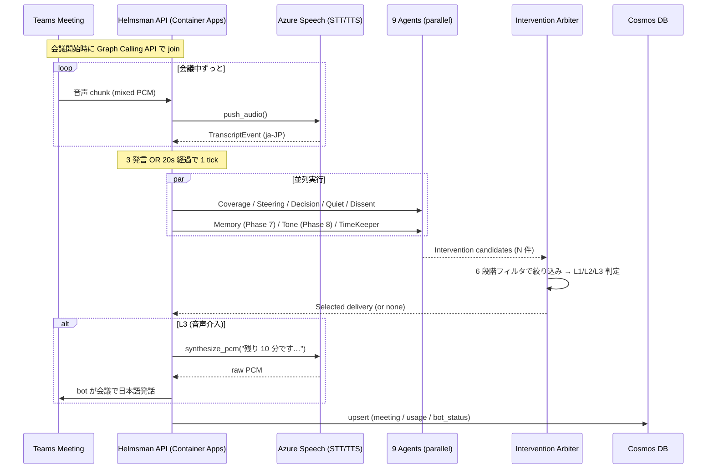
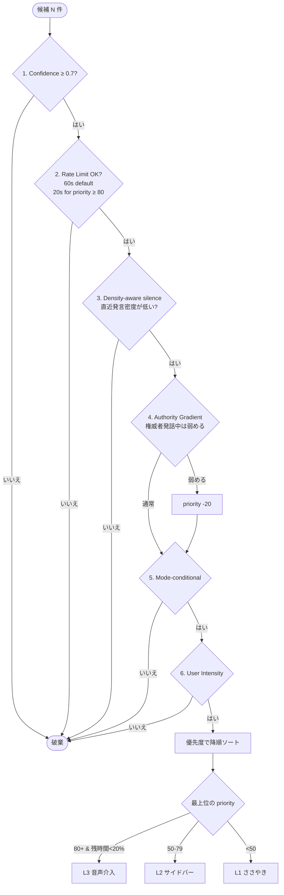

# 議事録 AI の「次」は、会議そのものを成功させる AI ― Teams に派遣できる "Helmsman" を Azure で個人開発した

> Microsoft Agent Hackathon 2026 個人部門エントリ作品の開発記です。
> 議事録 AI の次って何だろう、と考え続けた結果、「会議そのものを成功させる AI」というところにたどり着きました。

## はじめに

- **何を作ったか**: Microsoft Teams の会議に「Helmsman」という名前で参加して、議論をそっと見守ってくれる AI です。ここぞというときは、**会議の中で日本語の声で発言** までしてくれます。
- **いちばん伝えたいこと**: 偉い人がいると言いづらい反論、なかなか口を開けない人の意見、目上の人の事実誤認、「そろそろ時間ですよ」のひとこと ― **会議で人間が言いにくいことを、AI が代わりに言ってくれます**。
- **なぜ作ったか**: 議事録の AI は、もうかなり良いものが揃っています。でもそれって「うまくいかなかった会議を、あとからきれいに書き残してくれる」だけなんですよね。**会議が終わってからじゃなくて、会議の最中に手を入れる** ことが、次の一手だと思いました。
- **どう作ったか**: Azure の上で **9 人の AI** がそれぞれ違う観点から会議を見ていて、「司会の補佐役」がそれをまとめて、ちょうどいい塩梅で助け舟を出します。

## まず 3 分の動画を見てください

@[youtube](REPLACE_ME)

> 動画の流れ:
> - 0:00 月次役員会(物理 3 名 + Teams 2 名)スタート
> - 0:30 Helmsman bot が会議に入って、「今日決めたいこと」を 5 つに分ける
> - 1:00 ずっと黙っていたリモートの方に bot が声をかける
> - 1:30 「全員賛成」の空気を察知して、「他の視点はありますか?」と問いかけ
> - 1:50 ダッシュボードに参加者ごとの mood が出る。佐藤さんの直近 3 発言が懸念寄りで、全体は ⚠ TENSE に
> - 2:20 残り 8 分、bot が会議で日本語の音声で「撤退基準を決めましょう」と発言
> - 2:55 60 分で 5 つの論点ぜんぶ決着、決定 10 件がそのまま Planner に流れる

## 1. 議事録の AI はもう十分。じゃあ次は?

ここ数年で、会議が **終わってから** 動く AI は本当によくできるようになりました。

- **Microsoft Teams Premium** の Intelligent Recap が、発言を要約してアクションまで拾ってくれる
- **Otter / Fireflies / tl;dv / Fathom** が、文字起こしと要約をやってくれる
- **Notta / Read.ai** が、その場の雰囲気や盛り上がりまで可視化してくれる

でも、これって全部 **「会議が終わったあと、何が起きていたかをきれいに書き残す」** ものなんですよね。

> 議事録って、**うまくいかなかった会議の、うまくいかなかった様子を、ていねいに書き残してくれる**もの。でもそれだけだと「会議そのもの」はうまくいかないままで終わってしまう。

会議のあとに「あ、Aの話、結局決まってなかったね」と気づいても、もう一回集まるしかない。**結局、時間が増えちゃう** んです。

### 会議が「うまくいかない」4 つのパターン

実際の現場でよく起きる失敗は、だいたい 4 つに分けられます。

| こんなことありませんか? | 何が起きるか |
|---|---|
| **話が脱線してそのまま** | Aの話してたら派生で B が出てきて、B が盛り上がって A は未決のまま終了 |
| **時間が足りない** | 5 つ議題があったのに、最初の 2 つで 50 分使って、残り 3 つは雑に決まる |
| **言いたいことを飲み込む** | 役員が方針を出したあと「いいですね」連鎖、後日になって「実は…」 |
| **目上の人の勘違いを訂正できない** | 偉い人の発言が事実と違っても、その場で訂正できる人がいない |

これって、**会議の最中じゃないと、もう手遅れ** なんです。なかでも **「目上の人の勘違いを訂正できない」** は、日本の組織でいちばん辛くて、いちばん解きづらい問題だと感じています。

これを「AI に代わりに言ってもらおう」というのが、Helmsman でいちばん大事にしているところです。

## 2. ここがいちばんお伝えしたい ― AI が「言いにくいこと」を代弁します

技術の話よりも先に、これを話させてください。

### 2.1 人間って、けっこう言えないことがある

日本の会議で、私たちが「言いたいけど、なかなか言えない」ことは、だいたい 4 つあります。

1. **目上の人への反論** ― 「部長、それ違うと思います」
2. **黙っている自分の意見** ― 「あの、僕も意見があって…」と割って入るタイミングがつかめない
3. **目上の人の勘違いの指摘** ― 「先ほどの数字、資料と違いませんか?」
4. **「そろそろ時間ですよ」のひとこと** ― 議長を急かすのは角が立つ

これって、その人が弱いから言えないわけじゃなくて、**そういう仕組みになっちゃってる** んです。心理的安全性の高いチームでも、相手が CxO クラスになると、人間はやっぱり本能的に言いにくくなります。

### 2.2 AI が代わりに言うと、誰も気まずくならない

そこで Helmsman は、**AI に代わりに言ってもらう** ことで、誰も気まずくならない仕組みを作りました。

| 言いにくいこと | Helmsman の動き方 | なぜ角が立たないか |
|---|---|---|
| **目上の人への反論** | 「いいですね」連鎖を見つけたら、「他に検討すべき視点は?」と、誰の発言かは伏せて問いかけ | **AI が機械的に判断したこと** なので、誰かが反対したことにならない |
| **黙っている人の意見** | 発言量が少ない人に「○○さん、いかがですか」とそっと声をかける | 「AI に振られた」というクッションがあるから、本人が割って入らなくて済む |
| **目上の人の勘違い** | 事前にもらった資料と発言の食い違いを見つけて「戦略 Memo と違うかもしれません」 | AI が **資料と機械的に照合した結果** として出るので、誰が指摘したかは消える |
| **「そろそろ時間です」** | 残り時間が少なくなったら、bot が会議で「残り 10 分です、撤退ラインを決めましょう」と発言 | 議長が時間管理の責任を **AI と一緒に背負える** |

> **大事なこと**: これは「人間の代わりに AI が決める」じゃありません。**「人間が言いたいことを、AI が言ってくれる」** だけです。決めるのは、ずっと人間のままです。

### 2.3 会議中に言えなくても、レポートにはちゃんと残ります

会議中に間が悪くて言えなかったことも、**会議が終わったあとのレポート** にはちゃんと残るようにしています。

たとえば「9 月 15 日にローンチで決定」という結論には、こんな情報が添えて残ります。

- **決まったこと**: 9 月 15 日にローンチで決定
- **その瞬間**: (0:48:12) 山田 CTO「9 月 15 日で行きましょう」
- **まだ気になっていること**: (0:42:30) 高橋さん「QA 期間が 2 週間短いかも」→ **解消されないまま決まった**
- **資料との食い違い**: Q3 戦略 Memo では 9 月 30 日が前提 → スケジュール調整が要りそう

> **「会議中に言えなかった自分」を責めなくていいんです。AI が見ていてくれます。これが Helmsman のちいさな約束です。**

### 2.4 使いすぎたら人間関係が壊れます、だから歯止めも入れています

「AI に言ってもらえばいいじゃん」みたいに書いてきましたが、当然、**使いすぎたら逆に人間関係が壊れます**。なので、こんな歯止めを入れています。

- **目上の人が話しているときは、AI もちょっと黙る** ― 「AI に言わせる」を「AI で攻撃する」にしないため
- **どれくらい口を出すかは主催者が選べる** ― 「おとなしめ」「ふつう」「積極的」の 3 段階
- **誰の意見かは伏せる** ― 反対意見の代弁は必ず匿名で
- **議論が盛り上がってるときは黙る** ― 「議論を促す」と「議論を止める」をちゃんと分ける

> **AI は「言いにくいことを言う」役は引き受けるけど、「人間関係を壊す」役までは引き受けない**。この境界線を、§3 で出てくる「司会の補佐役」がちゃんと守ってくれます。

## 3. Helmsman の中身

ここから少しずつ、仕組みの話に入っていきます。

### 3.1 全体像 ― 9 人の観察役 + 1 人の司会補佐

Helmsman は、会議を見守る **9 人の役割分担された AI** と、そのみんなの声をまとめる **1 人の司会補佐** でできています。合わせて 10 人。人間のチームに置き換えるとこんな感じです。

| Helmsman の役回り | 人間で言うと |
|---|---|
| **ゴール分解係** | 冒頭で「今日決めたいことを 5 つに分けますね」と整理する人 |
| **進捗チェック係** | どの議題が終わったか、ノートに印をつける人 |
| **舵取り係** | 話が脱線したら「えーと、本題に戻ると…」と戻す人 |
| **決定の記録係** | 「いま 9/15 ローンチで決まりましたね」と確認する人 |
| **声かけ係** | 黙ってる人に「○○さん、どう思います?」と振る人 |
| **そっと一石を投じる係** | 全員賛成の空気に「他にリスクはないかな?」と聞く人 |
| **時間係** | 「残り 10 分です」と時計を見ている人 |
| **記憶係** 📜 (Phase 7) | 「前回の会議で X さん、これを ¥1200 で決めたんでしたよね」と思い出させる人 |
| **空気読み係** 🌡 (Phase 8) | 「○○さん、少し懸念がにじんでる発言が続いてます」と発言の温度感を見る人 (カメラは使わない) |
| **司会補佐** | 上の 9 人の声をまとめて「いま誰に何を言ってもらうか」を決める人 |

これ、実際の会議で **1 人の人間が全部やるのは、まあ無理** なんですよね。だからこそ「AI に並列でやってもらおう」というのが、Helmsman を作った素直な動機です。

### 3.2 1 サイクルの流れ ― 20 秒に 1 回、会議を見て、考えて、ちょっと動く

会議が始まると、Helmsman bot は Teams に入って、音声を文字に起こしながら **20 秒に 1 回くらいのペース** で「いま会議で何が起きてるかな」を見ています。

ざっくり、1 サイクルはこんな流れです。

1. 直近 20 秒の発言を、9 人の観察役みんなに渡す
2. みんなが同時に「気になったこと」を出してくる(「Aは決まった」「○○さんが黙りすぎ」「最近の発言、懸念が増えてる」みたいに)
3. 司会補佐が「いま助け舟を出すべきか? 出すならどれくらいの強さで?」を決める
4. 助け舟を出すと決まったら、ささやき / カード / 声 のどれかで届ける
5. 全部 Cosmos DB に記録して、ダッシュボードにも反映

これを 60 分の会議で **最大 180 回** くらい繰り返しています。

:::details エンジニア向け補足: tick サイクル全体図 (mermaid)



実装は `asyncio.gather` で 7 並列。実測平均レイテンシ **2.08 秒 / tick**。1 会議あたりの実コストは ~$0.03。

:::

### 3.3 司会補佐の「6 つの問い」― ようやく助け舟が出ます

9 人の観察役が「助け舟を出したい!」と手を挙げても、それを全部やっちゃうと **会議が AI のおせっかいで埋め尽くされて、もう会議じゃなくなります**。

なので、司会補佐は **6 つの問い** で「ほんとに今、出すべきか?」を確かめます。

1. **どれくらい自信ある?** ― 「これは絶対にいま言わなきゃ」と確信があるものだけ通す
2. **さっき似たやつ出してない?** ― 同じ種類の助け舟が連発しないように
3. **議論、盛り上がってない?** ― 盛り上がってるところに割り込まない
4. **目上の人が話してない?** ― 話してるなら、「黙ってる人にふる」系はちょっと弱める
5. **会議のモードに合ってる?** ― 「決める会議」でブレストっぽい提案を出さない
6. **主催者の好みは?** ― 「おとなしめ / ふつう / 積極的」の設定に合わせる

特に **3 番目の「盛り上がってない?」が、技術的にいちばん大事** でした。「発言が途切れたら助け舟を出す」のはタイマー 1 本で簡単に作れますが、**これがいちばん嫌がられる**。人間にとっての沈黙は「考えてる時間」だからです。

Helmsman は逆をやっていて、**直近 30 秒の発言密度が低いとき = みんなが行き詰まってるっぽいとき** だけ助け舟を出すようにしています。「活発な議論には黙って、行き詰まったら出てくる」。

:::details エンジニア向け補足: Arbiter 6 段フィルタの全体フロー



実装は約 280 行 + テスト 17 件。CHI 2025 の "Observe, Ask, Intervene" フレームの **future work (介入タイミングの具体化)** を実装で埋めた位置にあります。

:::

### 3.4 助け舟の強さは 3 段階 ― 「ささやき / カード / 声」

Helmsman の助け舟には、**おせっかい度の違う 3 段階** があります。

- **① ささやき** ― 主催者の画面にだけそっと表示。他の人には見えません。「あ、○○さん黙ってますね」みたいな軽い気づき。
- **② カード** ― 全員の画面に控えめなカードで届ける。「他に検討すべき視点はありますか?」みたいな、ふんわりした問いかけ。
- **③ 声** ― ここが本気のところ。bot が **会議で実際に日本語の声で発言** します。「残り 10 分です、撤退ラインを決めましょう」みたいな、ここぞというときだけ。

③ はデモを見ていただくといちばんびっくりする瞬間です。**「AI が会議で声で喋る」** って、最初に見ると本当に「えっ」ってなります。声は Azure Speech の `ja-JP-NanamiNeural` で、聞いていて違和感のない自然なイントネーションで話してくれます。

> ちなみに、この「見守る → そっと聞く → 声に出す」の段階分けは、CHI 2025 で発表された "Observe, Ask, Intervene" というフレームに対応しています。① と ② が "Ask"(人間に確認する)、③ が "Intervene"(実行する)です。

## 4. 会議が終わったあとのレポートも、AI が書いてくれます

会議が終わったら、Helmsman は **会議のレポート** を自動で作ります。「もう一回タイプし直すの、面倒くさい」をなくしたかったんです。

### 4.1 3 つの使い方

| こんな日には | 入力するもの | Helmsman の仕事 |
|---|---|---|
| **会社の議事録テンプレが決まってる** | テンプレ(markdown)を貼る | 会社のフォーマットに合わせて埋める。決定の根拠も `> 引用` で添える |
| **会議中に手元でメモしてた** | 手書きメモを貼る | メモを最優先に取り込みつつ、Helmsman の構造化結果で足りないところを補う |
| **メモ取る余裕なかった** | 何も入れなくて OK | 標準の 6 章構成(サマリ / ゴール / 決定 / 未解決 / ネクスト / 資料との齟齬)で書き出す |

### 4.2 「どの情報をいちばん信じるか」は順番がはっきり決まっています

レポートを作るとき、AI は 3 つの情報源を持っています。

1. **あなたのメモ** ― いちばん信じる(人間が手で書いたものだから)
2. **Helmsman が会議中に集めた結果** ― 各論点の決定と、その根拠の発言
3. **会議の発言ログそのもの** ― おまけの情報として参照

これらが食い違ったときは、**両方を並べて「事実関係要確認」と書く** ようにしています。AI が勝手にどっちかを採用しません。

レポート 1 通は **6-10 秒、だいたい $0.01** で完成します。会議 1 本($0.03)と合わせても **$0.04 / 会議** くらいで済む計算です。

## 5. 他の Meeting AI とは、ちょっと立ち位置が違います

世界の主要な Meeting AI を、**「タイミング(終わったあと ← → リアルタイム)」と「動き方(見るだけ ← → 助け舟を出す)」** の 2 軸で並べると、ぽっかり空いている場所が見えてきます。

```mermaid
quadrantChart
    title 2026 AI Meeting プロダクトマップ (公開機能ベースで筆者整理)
    x-axis 事後分析 --> リアルタイム
    y-axis 受動 (観測のみ) --> 能動 (介入する)
    quadrant-1 "リアルタイム × 能動"
    quadrant-2 "事後 × 能動"
    quadrant-3 "事後 × 受動 (既存議事録 AI の主戦場)"
    quadrant-4 "リアルタイム × 受動"
    Granola: [0.15, 0.20]
    Otter: [0.30, 0.28]
    Fathom: [0.18, 0.22]
    Fireflies: [0.20, 0.20]
    tl;dv: [0.18, 0.18]
    Sembly: [0.25, 0.35]
    Read.ai: [0.55, 0.45]
    MS Facilitator: [0.60, 0.50]
    Cluely: [0.75, 0.55]
    Helmsman: [0.85, 0.90]
```

- **左下(終わったあと × 見るだけ)** = Granola / Otter / Fathom / Fireflies / tl;dv / Sembly。**もう成熟しているところ**
- **右下(リアルタイム × 見るだけ)** = ほぼ空白
- **右上(リアルタイム × 助け舟を出す)** = Cluely / MS Facilitator / Read.ai が薄く存在
- **Helmsman は、ここに「9 人並列で見守る + 3 段階の助け舟 + 音声で発言」まで踏み込んだ、わりと珍しい立ち位置**

### 代表 4 製品との比べ方

| 観点 | Granola | Cluely | Read.ai | MS Facilitator | **Helmsman** |
|---|---|---|---|---|---|
| **主に何のため?** | 個人の議事録 | 個人の商談コーチ | 雰囲気の可視化 | Teams 補佐(テキスト) | チーム会議の能動的な助け舟 |
| **いつ動く?** | 会議のあと | 会議中 | 会議中 + あと | 会議中 + あと | 会議中 |
| **誰に届く?** | 自分だけ | 自分だけ | 主催者 | chat | **主催者 / 全員 / 声で全員** |
| **声で喋る?** | なし | なし | なし | なし | あり(Azure Nanami) |
| **公開価格** | $0 / $14-35 | $19 / $49 | $0 / $19.75 | M365 Copilot $30+ | Azure 従量(TBD) |
| **配布** | クローズド | クローズド | クローズド | クローズド | **MIT のオープンソース** |

> この表は「どっちが上」じゃなくて、「立ち位置が違うんだな」と思って見ていただけると嬉しいです。各社のプロダクトはそれぞれよくできてます。

**Helmsman を選びたくなるのは、こんなとき**:

- 複数人の会議で **ちゃんと助け舟を出してほしい**(Granola や Read.ai は見守るところまで)
- **声で言ってほしい**(Cluely や Facilitator は文字が中心)
- **外の人も参加する会議**(Facilitator は M365 Copilot のライセンスがある人にしか効かない)
- **オープンソースで自分でカスタマイズしたい**(上の 4 つは全部クローズド)

## 6. 参加者に怖がられないように、ちゃんと気を遣ってます

会議に AI が入ると、参加者はやっぱり「えっ、大丈夫?」と思います。Microsoft の Responsible AI Standard v2 の 6 原則に沿って気を配っています。

| 原則 | Helmsman でやっていること |
|---|---|
| **公平性** | 発言量に偏りがあれば声かけ役が動く。同意連鎖を見つけたら別の視点を添える |
| **信頼性と安全性** | 「決まった」と判断するときは必ず根拠発言の **そのままの言葉** を引用させる(AI のつくり話を構造的に防ぐ) |
| **プライバシー** | 音声と文字起こしは **30 日で自動削除**。声紋データの保存は本人がはっきり同意したときだけ |
| **包摂性** | 立場の上下を尊重しつつ、助け舟の強さは主催者が選べる |
| **透明性** | 助け舟にはぜんぶ「どの観察役が、何を見てそう言ったか」が添えてあります |
| **説明責任** | LLM の呼び出しは Application Insights に全記録、コストもかかった時間も毎日まとめて見られる |

会議に入る前には **「Helmsman が入ります」というお知らせダイアログ** を出して、参加者に同意してもらいます。EU AI Act や改正個人情報保護法も意識した設計です。

## 7. 実装で「これも入れたかった」2 つの機能 ― 記憶 と 感情

会議を 1 回だけ良くするのも大事ですが、**会議をまたいで覚えていてくれる** ことと、**いま誰がどんな気持ちで話してるかが分かる** ことも、同じくらい大事だと思って実装しました。

### 7.1 📜 記憶係 (Phase 7、実装済) ― 会議をまたいで決定を思い出す

シリーズ会議(毎週の定例)やグループ会議(同じプロジェクト)を超えて、過去の決定を引いてきます。9 番目の agent **MemoryRetriever** が担当。

仕組みはシンプルな 2 段構成です。

1. **決定が確定するたび** に、Cosmos と Azure AI Search に保存(text-embedding-3-small で 1536 次元ベクトル化)
2. **次の会議の議論中** に、現在のトピックを embed → AI Search の HNSW vector index で類似決定を上位 5 件取得 → MINI モデルが「今表に出すべきか」を判断 → 介入候補に

スコープと絞り込み:

- 主催者ごとに分離(他人の決定は見えない)
- 同じ定例会議なら +0.30 スコアブースト
- 同じプロジェクトなら +0.15
- 90 日で線形に減衰

「History」ページに自然言語検索バーがあって、**「あの時 X 決めたやつ」** と書くだけでベクトル類似で並べてくれます。1 件 1 件、元の会議へリンクで戻れます。

**AI Search が無くても動く** ように、numpy 経由の in-process cosine フォールバックを最初から実装しました(個人 organizer の決定数なら全件 scan でも < 50ms)。

### 7.2 🌡 空気読み係 (Phase 8、実装済) ― 発言から感情を読みます (カメラは使わない)

「いま誰がどんな気持ちで話してるか」をダッシュボードに出るようにしました。10 番目の agent **ToneAgent** が担当します。

#### 設計判断: 顔から撤退して、発言テキストに振り直しました

正直に書くと、これは **失敗から学んだ実装** です。最初は MediaPipe FaceLandmarker でカメラから「うなずき」「困惑」を読む Phase 6 を作りこんでいて、コードもテストも 2,500 行ほど書いていました。途中で 2 つの壁にぶつかって、ぜんぶ撤去しました。

- **壁 1: Teams 会議の全員の映像は、Python の bot からは取れない**。Microsoft 公式の media SDK は C# 専用で、Windows host も実質必須。既存の Python + Linux container 基盤と相性が悪く、ハッカソン期限内に書き直すリスクが高すぎる
- **壁 2: ダッシュボードを開いてカメラ ON にしてくれる参加者を、当てにできない**。「opt-in カメラ」は設計としては綺麗だけど、現実の会議では誰もカメラ ON にしない。データが取れない機能は無いのと同じ

そこで気づいたのは「**Bot がすでに文字起こしのために発言テキストを取ってるんだから、そこから感情を読めばいい**」というシンプルな事実でした。カメラを使わないので、**新しい個人データを 1 バイトも増やさずに** 同等の signal が取れる ― これが Phase 8 (ToneAgent) の出発点です。撤去した 2,500 行は、**何を作るべきじゃないか** を学ぶための授業料でした。

副産物として、frontend bundle が **約 5MB 軽くなりました** (MediaPipe WASM + model file を削除)。

#### どんな信号を取っているか

各発言テキストに対して、LLM (gpt-5.4-mini) が以下の 6 ラベルから 1 つだけ選びます。

| ラベル | 何を見ているか | 例 |
|---|---|---|
| **joy** 😊 | 楽観・喜び・熱意 | 「これ、すごく良いと思います」 |
| **agreement** 👍 | 賛同・受容・合意 | 「はい、それで進めましょう」 |
| **curiosity** 🤔 | 問いかけ・探求・興味 | 「なぜそうなるんでしたっけ?」 |
| **concern** 😕 | 懸念・困惑・不安 | 「ちょっと心配な点があって…」 |
| **frustration** 😤 | 苛立ち・行き詰まり・否定 | 「いや、それじゃ無理です」 |
| **neutral** 😐 | 事実陳述・無感情 | 「今週は 3 件、対応しました」 |

合わせて -1.0 〜 +1.0 の **sentiment スコア** も推定します。

#### 全体の温度感 (Mood)

話者ごとの感情を集めて、会議全体を 4 つの mood に分類してダッシュボードで可視化します。

| Mood | 判定条件 |
|---|---|
| **TENSE** ⚠ | concern + frustration が 40% 以上 |
| **ALIGNED** ✦ | agreement が 30% 以上 + sentiment > 0.2 |
| **ENERGETIC** ⚡ | joy + curiosity が 40% 以上 |
| **STUCK** ~ | 上記いずれにも当てはまらない(中立発言が続いている、空気が止まっている) |

#### ダッシュボードでの見え方

- **LiveTranscript**: 各発言の右に絵文字バッジ ("👍 賛同" "😕 懸念" 等) と話者名(UUID ではなく実名)
- **ParticipantsPanel**: 話者ごとに「主に積極的 😊」「困惑気味 😕」などの傾向バッジ、直近 8 発言の感情をカラードットで流す stream
- **Mood meter**: ヘッダーに `⚠ TENSE` のような今の状態ラベル + sentiment スライダー(中央線 + 色付きマーカーが左右にリアルタイムで動く)

#### 介入のトリガー

ToneAgent 自身も 1 つだけ介入候補を出します: **直近 8 発言の 50% 以上が concern/frustration かつ 45 秒以上沈黙** → 「議論が少し止まっているようです。引っかかっている点を一度言葉にしてみませんか?」を Arbiter に投げ、L2 で発火。

#### プライバシー

カメラ・マイクの追加収集は一切ありません。すでに Bot が文字起こしのために受け取っている発言テキストを LLM に渡して感情ラベルを得るだけです。**新しい個人データを増やさない**、というのが Phase 6 (カメラ) を撤去して Phase 8 に振り直した最大の理由です。

## 8. 中で使っている技術 ― なぜこの組み合わせ?

ハッカソンの必須要件「Azure の実行基盤 + Microsoft の AI 技術 を最低 1 つずつ」に対して、**8 つのサービスを重ねて** 満たしています。

| ハッカソンの要件 | Helmsman での対応 |
|---|---|
| **Azure 実行基盤** どれか必須 | Azure Container Apps (backend) + Static Web Apps (frontend) |
| **Microsoft AI 技術** どれか必須 | Azure OpenAI (gpt-5.4 / mini) + Azure AI Speech (STT/TTS) |
| Cosmos DB 推奨 | Serverless で 5 つの container |
| GitHub Copilot 推奨 | 開発の全工程で使用 |
| Microsoft Entra ID 推奨 | Bot Framework 認証 + GitHub Actions OIDC |

:::details エンジニア向け補足: 開発で「あちゃー」ってなった瞬間 4 連発

実装で本当に痛かったのは、論文化を狙えそうな Arbiter 設計ではなく、もっと泥臭い 4 つの瞬間でした。

| # | 何を間違えたか | 効いた修正 |
|---|---|---|
| 1 | **Arbiter rate_limit が wall-clock 依存** ― offline replay で 25 分会議を 70 秒で再生したら 2 件目以降が全部 drop | `decide(now=...)` で時刻 inject、eval は audio_time を渡す |
| 2 | **「高い tier = 高品質」と信じていた** ― gpt-5.4 (HIGH) で動かしていたら cheap (mini) のほうが decisions 2×、コスト 1/6 で勝った | 全 agent 毎に tier を選べる設計に統一、本番推奨を `--cheap` に格上げ |
| 3 | **ACS の `TeamsMeetingLinkLocator` が SDK 全バージョンに存在しない** ― Microsoft 公式 docs を信じて実装、本番 ImportError | Service-hosted Graph Calling Bot に方針転換、Application Access Policy を PowerShell で設定 |
| 4 | **Decision Capture が memo を過信** ― memo に書かれていない決定を memo 由来として書く幻覚 | 「ルール: 推測で事実を書かない」を追加 |

**学び**: Agentic AI のデバッグは「LLM がおかしい」ではなく **「人間側の制御設計がおかしい」** ケースのほうがずっと多いです。

:::

## 9. これからやっていきたいこと

会議そのものを良くする AI として、Helmsman は「会議の最中」と「会議が終わったあと」の両方に手を入れる構造ができました。でも、ここから先 **本当に組織で役に立つ AI** にしていくには、まだやりたいことがいくつも残っています。4 つの方向で考えていることを、順番に書かせてください。

### 9.1 「決まったこと」をそのまま仕事に流したい ― Power Automate 連携

会議で決まったことって、結局そのあと **誰かが手で Planner や DevOps の Work Item に転記する** ことになりますよね。これ、本当にもったいないんです。Helmsman は会議中に **「いつ、誰が、何を決めたか」を構造化された形で全部捕まえてる** わけで(§2.3 のレポートに残るやつ)、ここを Power Automate のフローに繋げれば、転記の手間は完全になくせるはずです。

具体的に考えているのは、こんな流れです。会議中、決定の記録係が「9 月 15 日にローンチで決定」を確定させたその瞬間に、Power Automate のフローが発火して Planner にカードが立つ。担当者と期限は決定の文脈から推測される ― 「9 月 15 日に山田 CTO がローンチを宣言したので、QA リードの高橋さんがオーナー」のような形で。

ここでいちばん大事だと思っているのは、**「決定をそのまま流す」ではなくて、「決定に紐づく未解決の懸念も一緒に流す」** ことです。会議中に解消されなかった懸念って、後日 Slack やメールで再燃するんですよね。その時にはもう文脈が消えていることが多い。Planner カードに最初から「この決定の時、これが解消されてませんでした」とぶら下がってると、担当者は何を確認すべきかが分かる状態でスタートできます。

ここは Microsoft Copilot Studio の Multi-Agent を組み合わせるのが綺麗な選択肢だと考えていて、§8 では「自前で書いた理由」を書きましたが、Phase 9 は **「ホスト向けセットアップ Agent」として Copilot Studio を再登場させる場** にしたいと思っています。会議の招待 URL を投げたら、自動で Bot 派遣 + Planner 紐付け + 担当者通知 までやってくれる、というのが理想形です。

### 9.2 組織の中で「似た論点」に気づきたい ― 横断知識化

会議で起きる本当の損失って、**「実は隣のチームが先月、同じ論点で同じ結論を出してた」** ことだと思うんですよね。これは記憶係 (§7.1) の延長線で、いま **主催者ごとにスコープを分離している** ベクトル検索を、**組織単位で横断できる** ようにしたい。

ただ、これは技術的に作るのは簡単で、**人間関係的に難しい** やつなんです。主催者の決定を横断検索できるようにすると、「あの人、こんなこと決めてたのか」が見えちゃう。意図しない情報非対称の解消は、組織にとっては負荷にもなりうる。なので Phase 10 は、技術より先に **「誰の決定が、誰に見えていいか」** を設計する必要があります。

たとえばこんな見え方の階層を考えています。同じプロジェクト会議の決定はメンバー全員に見える(これは記憶係でほぼ実装済)、部署単位の決定はその部署の人にだけ見える、全社で公開しても安全な決定は organizer が明示的に「全社公開」フラグを付けたものだけ。そのうえで、**新しい会議で「過去の似た決定」が出てきたら、記憶係が「これ、別チームでも先月決めてますよ」と差し込んでくる** ようにしたいんです。同じ問いに 2 回会議を使わなくて良くなる ― 組織レベルでの Helmsman の本来の効果は、ここから出てくると思っています。

ここで難しいのは、**「似た」の閾値設計** です。表面的にベクトル類似度が高いだけだと、まったく違う文脈の決定がぶつけられて逆にノイズになる。これは記憶係で 90 日減衰やシリーズ会議の boost を入れた延長で、**組織トポロジー(部署/プロジェクト/役職)を距離関数に組み込む** 形になりそうです。技術的にも面白い領域ですが、ここで失敗するとプロダクトとしては逆に「うざい AI」になるので、慎重に詰めていく予定です。

### 9.3 声色までその場の空気に合わせたい ― Hume EVI 連携

いまの音声介入(§3.4 の ③)は、Azure Speech `ja-JP-NanamiNeural` の **固定 prosody** です。これは聞いていて自然なんですが、**会議の空気が緊張しているときに同じトーンで話すと、ちょっと浮く** ことがあります。たとえば全員が困った顔をしている瞬間に明るい声で「残り 10 分です、撤退ラインを決めましょう」と入ると、せっかくの空気がプツッと切れる。

そこで Hume EVI (Empathic Voice Interface) のような **会話の感情状態に応じて TTS の prosody を変調する API** を組み合わせたいと考えています。空気読み係(§7.2)で会議全体の温度感はもう取れているので、

- mood が `⚠ TENSE` なら、声色を **少し落として、ゆっくり** 話す
- `⚡ ENERGETIC` なら、**キビキビと、間を短く**
- `~ STUCK` なら、**穏やかに、問いかけ調で**

という分岐が自然に書けるはずです。Helmsman の介入は、ここまでで **「何を言うか」(司会補佐の 6 つの問い)** と **「誰に向けて言うか」(代弁構造 + 3 段階の助け舟)** が組まれていて、Phase 9 以降で **「どんな声色で言うか」** の軸が加われば、3 軸すべてで会議と同期する介入になります。介入の説得力って、最終的にはこの 3 軸が揃ったときに最大化されるんじゃないかと、いま考えています。

ただし、これは **API 検証も、コスト試算も、倫理レビューも全部未済** です。感情応答 TTS は新しい Responsible AI の課題(「AI が感情を演じることが、参加者の自然な感情表現を抑制しないか」など)を生むので、空気読み係のテキスト感情とは別のレビュー軸が必要だと考えています。なので、まだ「ロードマップにある」というよりは「**気になっている方向**」というステータスです。

### 9.4 物理の会議室にも入っていきたい

Helmsman は今、**Teams 会議への参加** に絞って作っています。これは「全員 Teams 経由なら、bot も Teams 参加者の 1 人として入れる」という一番きれいなパスだからです。でも、現実の会議の半分以上は **物理の会議室 + 一部リモート** のハイブリッドで、ここに踏み込めると効く範囲がぐっと広がります。

物理側で必要になるのは、**共有マイク 1 本** で全員の発言を取ること、**声紋識別** で「誰が話してるか」を解決すること、そして **物理参加者の Teams クライアントを開かせない UX**(会議室の TV モニタに Helmsman のダッシュボードを表示する形)です。

声紋識別は技術的には Azure AI Speech の Speaker Recognition で組めますが、**「物理で会議室に入っただけで声紋を取られるのは、どこまで OK か」** という倫理面の整理がいちばん難しい。これは opt-in をどう取るか、参加者にどう告知するか、声紋データをいつまで保持するか、を含めて検討していく必要があります。技術より先に **「物理空間に AI が常駐することの社会的合意」** をどう作るか、というところから考えたい領域です。

---

ここまで 4 つ書いてきて、改めて思うのは、**Helmsman に残っている課題はもう「技術的にどう作るか」よりも「人間の側でどう受け止めるか」のほうが大きい** ということです。AI が会議で喋ることに慣れていく過程、組織の決定が横断的に見える社会、声色まで AI が空気を読む時代 ― そういう未来の手触りを、ひとつずつ小さく実装で確かめていけたら、と思っています。

## 10. 最後に

- 議事録の AI はもう成熟したけど、**「会議をその場で良くする AI」** はまだほとんど誰もやってない領域でした。Helmsman は、その空白に踏み込んだひとつの実装です。
- **いちばん大事にしたところ**: 会議で人間が **どうしても言いにくい 4 つのこと** を AI が代弁することで、誰も気まずくならない仕組みを作りました。
- **9 人の観察役 + 6 つの問いを通す司会補佐** という Agentic AI の作り方で、「いつ・誰に・どんな強さで助け舟を出すか」をちゃんと考えて出します。会議中に間に合わなかった懸念も、**最後のレポートには必ず残る**。
- **失敗も書きました**: カメラ路線 (Phase 6) を 2,500 行書いてから撤去した話を §7.2 に正直に書いています。**何を作るべきじゃなかったか** も技術記事の正しい中身だと思っています。
- 中身は Azure Container Apps / OpenAI / Speech / Cosmos / AI Search / Static Web Apps / Bicep + OIDC の Microsoft 主軸で、ハッカソンの必須要件を 8 サービスで多重に満たしています。

## Appendix A: よく聞かれそうな質問

### Q1. AI が会議で喋るのって、怖くないですか?

A. 怖くないように作っています。Helmsman は **「言いにくいことを言う」だけで、何かを決めることはありません**。決めるのはいつも人間です。助け舟の頻度も主催者が「おとなしめ / ふつう / 積極的」で選べます。

### Q2. プライバシーは大丈夫ですか?

A. 会議に入る前に **「Helmsman が入ります」というお知らせ** を出して、全員に同意してもらいます。音声と文字起こしは **30 日で自動で消えます**。声紋データの保存も、本人がはっきり同意したときだけです。

### Q3. 感情はどうやって読んでるんですか? カメラ使うんですか?

A. **カメラは使いません**。すでに Bot が文字起こしのために受け取っている発言テキストを LLM (gpt-5.4-mini) に渡して、6 つの感情ラベルと sentiment スコアに分類しているだけです。新しい個人データを集めることはありません。

### Q4. 「あの時こう決めましたよね」って、AI が間違って言うことありますか?

A. 安全装置を 3 段重ねています。

1. ベクトル類似で過去決定を上位 5 件取ってきた後、**MINI モデルがもう 1 回「今この場で言う価値あるか」を判定** します。confidence < 0.6 ならボツに
2. **同じ会議内で 1 つの過去決定を 2 回出さない**
3. **90 日経った決定はスコアが線形に下がる**ので、自然に古いものは出にくくなる

## Appendix B: 関連リンク

### Microsoft 公式リファレンス

- [Microsoft Teams Facilitator (Learn)](https://learn.microsoft.com/ja-jp/microsoftteams/facilitator-teams)
- [Microsoft Teams Intelligent Recap (Learn)](https://learn.microsoft.com/en-us/microsoftteams/intelligent-recap-calls-meetings)
- [Microsoft Responsible AI Standard v2](https://blogs.microsoft.com/wp-content/uploads/prod/sites/5/2022/06/Microsoft-Responsible-AI-Standard-v2-General-Requirements-3.pdf)

### 学術 (引用した先行研究)

- Houtti, M., Zhou, M., Terveen, L., Chancellor, S. (2025). **"Observe, Ask, Intervene: Designing AI Agents for More Inclusive Meetings"**, CHI '25. [arxiv.org/abs/2501.10553](https://arxiv.org/abs/2501.10553)
- Anthropic Engineering, **"Building Effective Agents"**: [anthropic.com/research/building-effective-agents](https://www.anthropic.com/research/building-effective-agents)
